# Session 09 — Design Dataflow Graph : architecture unifiée

## Motivation

La SearchQueue actuelle (doc 08, commit `3c1a710b4`) utilise un contexte partagé (`SearchContext`) avec des ops dans une queue round-based et des dépendances Promise-like (`.then()`). Ça marche pour 5 ops, mais ne scale pas vers :

- **Éditeur visuel** : on veut représenter les pipelines comme des graphes éditables
- **Pipelines d'ingestion** : réutiliser le même framework pour l'OperationQueue
- **Étapes LLM** : normalisation, déduplication, enrichissement par LLM dans le pipeline
- **Agentic** : le LLM décide dynamiquement quels nœuds suivants activer
- **Rhai** : scripts custom s'intègrent comme des nœuds natifs
- **Composabilité** : assembler des pipelines à partir de briques réutilisables

Le problème fondamental du contexte partagé : **couplage implicite**. FetchRemainingProcessor doit savoir que SearchRelatedProcessor a écrit dans `context.matched_children`. Dans un dataflow, les données passent sur les arêtes — le couplage est **explicite et visible**.

---

## Modèle : Node / Port / Edge

### Node

Un nœud = une unité de traitement avec des ports d'entrée et de sortie typés.

```rust
#[async_trait]
pub trait Node: Send + Sync {
    /// Nom unique du nœud (pour debug, sérialisation, éditeur)
    fn name(&self) -> &str;

    /// Ports d'entrée déclarés
    fn inputs(&self) -> &[PortDef];

    /// Ports de sortie déclarés
    fn outputs(&self) -> &[PortDef];

    /// Exécution — lit les inputs, écrit les outputs
    async fn execute(&self, ctx: &mut NodeContext) -> Result<(), NodeError>;
}
```

### Port

```rust
pub struct PortDef {
    pub name: &'static str,
    pub value_type: PortType,
    pub required: bool,        // un port optionnel peut ne pas être connecté
}

pub enum PortType {
    Results,         // Vec<UnifiedResult>
    Children,        // HashMap<String, Vec<ChildSummary>>
    Uuids,           // Vec<String>
    Entities,        // Vec<BTreeMap<String, CypherValue>>
    Relation,        // String (nom de relation)
    Query,           // String
    Map,             // BTreeMap<String, CypherValue>
    Any,             // serde_json::Value — pour Rhai / custom
}
```

### Edge

```rust
pub struct Edge {
    pub from: (NodeId, &'static str),   // (nœud source, port sortie)
    pub to: (NodeId, &'static str),     // (nœud destination, port entrée)
}
```

Une arête connecte un port de sortie d'un nœud à un port d'entrée d'un autre. La runtime vérifie la compatibilité des types au moment de la construction du graphe.

### NodeContext

```rust
pub struct NodeContext<'a> {
    inputs: HashMap<&'static str, PortValue>,
    outputs: HashMap<&'static str, PortValue>,
    /// Services partagés (catalog, db, embedder, etc.)
    services: &'a ServiceRegistry,
    /// Pour les nœuds dynamiques : émettre de nouveaux nœuds/edges
    graph_emit: &'a mut GraphEmitter,
}

impl<'a> NodeContext<'a> {
    /// Lire un port d'entrée typé
    pub fn input<T: FromPortValue>(&self, port: &str) -> Result<&T, PortError>;

    /// Écrire un port de sortie typé
    pub fn output<T: IntoPortValue>(&mut self, port: &str, value: T) -> Result<(), PortError>;

    /// Accès aux services (catalog, db, embedder...)
    pub fn service<S: Service>(&self) -> &S;
}
```

### PortValue — Enum de transport

```rust
pub enum PortValue {
    Results(Vec<UnifiedResult>),
    Children(HashMap<String, Vec<ChildSummary>>),
    Uuids(Vec<String>),
    Entities(Vec<BTreeMap<String, CypherValue>>),
    Relation(String),
    Query(String),
    Map(BTreeMap<String, CypherValue>),
    Any(serde_json::Value),
    Empty,
}
```

`PortValue` est un enum fermé pour les types connus, avec `Any` comme escape hatch pour Rhai/custom. Le pattern matching reste possible sur les types built-in.

**Trade-off** : `Box<dyn Any>` donnerait plus de flexibilité mais perdrait le pattern matching et la sérialisabilité. `serde_json::Value` partout serait uniforme mais perdrait la type-safety. L'enum est le bon compromis pour un framework avec ~10 types de données connus.

---

## Typage des ports

### Vérification statique (construction du graphe)

```rust
impl DataflowGraph {
    pub fn connect(
        &mut self,
        from: (NodeId, &'static str),
        to: (NodeId, &'static str),
    ) -> Result<(), GraphError> {
        let out_port = self.node(from.0).outputs().find(from.1)?;
        let in_port = self.node(to.0).inputs().find(to.1)?;

        // Vérification de compatibilité
        if !out_port.value_type.compatible_with(&in_port.value_type) {
            return Err(GraphError::TypeMismatch { from, to, expected, got });
        }
        self.edges.push(Edge { from, to });
        Ok(())
    }
}
```

Règles de compatibilité :
- Même type → OK
- N'importe quoi → `Any` → OK (pour Rhai)
- `Any` → type concret → vérification au runtime (downcast)

### Vérification dynamique (exécution)

```rust
impl NodeContext {
    pub fn input<T: FromPortValue>(&self, port: &str) -> Result<&T, PortError> {
        let value = self.inputs.get(port).ok_or(PortError::NotConnected)?;
        T::from_port_value(value).ok_or(PortError::TypeMismatch)
    }
}
```

`FromPortValue` est un trait avec implémentations pour chaque type concret. Le pattern est similaire à `FromSql` dans les DB drivers.

---

## DAG statique vs dynamique : modèle hybride

### Le problème

- **Ingestion** : pipeline fixe (Chunk → Insert → Link → Aggregate → Embed). DAG statique.
- **Search** : Expansion décide au runtime combien de FetchRelated spawner. DAG dynamique.
- **Agentic** : le LLM décide quel nœud activer ensuite. DAG très dynamique.

### Solution : Templates + Instanciation

Un **template** est un DAG statique avec des nœuds "factory" qui peuvent instancier des sous-graphes au runtime.

```rust
/// Nœud spécial : peut émettre de nouveaux nœuds/edges pendant l'exécution
pub trait DynamicNode: Node {
    /// Après execute(), le runtime collecte les nœuds/edges émis
    /// et les intègre au graphe avant de continuer le tri topologique
    async fn execute(&self, ctx: &mut NodeContext) -> Result<(), NodeError>;
    // ctx.graph_emit.add_node(node) + ctx.graph_emit.connect(...)
}
```

**Cycle d'exécution :**

```
1. Construire le DAG initial depuis le template
2. Tri topologique
3. Pour chaque niveau (nœuds sans dépendances non-résolues) :
   a. Exécuter les nœuds en parallèle
   b. Si un nœud a émis de nouveaux nœuds/edges :
      - Intégrer au graphe
      - Re-trier topologiquement les nœuds restants
   c. Propager les outputs sur les edges → inputs des nœuds suivants
4. Boucle jusqu'à ce que tous les nœuds soient exécutés
5. Guard max_iterations pour éviter boucle infinie
```

### GraphEmitter

```rust
pub struct GraphEmitter {
    new_nodes: Vec<(NodeId, Box<dyn Node>)>,
    new_edges: Vec<Edge>,
    /// Connect output ports of THIS node to input ports of new nodes
    connections_from_self: Vec<(&'static str, NodeId, &'static str)>,
}

impl GraphEmitter {
    pub fn add_node(&mut self, node: impl Node) -> NodeId;
    pub fn connect(&mut self, from: (NodeId, &str), to: (NodeId, &str));
    /// Shortcut : connect self.output_port → new_node.input_port
    pub fn pipe_to(&mut self, output_port: &str, node_id: NodeId, input_port: &str);
}
```

---

## Mapping : SearchQueue actuelle → Dataflow

### Nœuds built-in Search

| Nœud | Inputs | Outputs | Correspond à |
|------|--------|---------|-------------|
| `PrimarySearchNode` | query: Query, options: Map | results: Results, meta: Map | PrimarySearchProcessor |
| `ExpansionNode` | results: Results, rules: Map | *(dynamique)* | ExpansionProcessor |
| `FetchRelatedNode` | parents: Uuids, relation: Relation | children: Children | FetchRelatedProcessor |
| `ComposeNode` | results: Results, children: Children | results: Results | ComposeProcessor |
| `SearchRelatedNode` | parents: Uuids, relation: Relation, query: Query | matched: Results | *(futur)* |
| `JoinNode` | *N inputs* | merged: Children | merge N sources de children |

### Template Search (sans expansion)

```
                    ┌──────────────────┐
 query ────────────→│  PrimarySearch   │
 options ──────────→│                  │──→ results ──→ (output)
                    └──────────────────┘
```

### Template Search (avec expansion HAS_FILE)

```
                    ┌──────────────────┐
 query ────────────→│  PrimarySearch   │──→ results ─────────────────→┐
 options ──────────→│                  │──→ meta                      │
                    └──────────────────┘                              │
                              │ results                              │
                              ▼                                      │
                    ┌──────────────────┐                              │
                    │    Expansion     │ (DynamicNode)                │
                    │   rules=HAS_FILE │                              │
                    └──────────────────┘                              │
                         │ (runtime)                                 │
                         │ émet FetchRelatedNode(s)                  │
                         ▼                                           │
                    ┌──────────────────┐                              │
                    │  FetchRelated    │──→ children ──→┐             │
                    │  rel=HAS_FILE    │                │             │
                    └──────────────────┘                │             │
                                                       ▼             ▼
                                                ┌──────────────────────┐
                                                │      Compose         │──→ results
                                                └──────────────────────┘
```

L'`ExpansionNode` est un `DynamicNode` : il inspecte les results, filtre par entity type, et pour chaque rule émet un `FetchRelatedNode` connecté au `ComposeNode`.

### Template Search (avec SearchRelated + exclude)

Le pattern "exclude" du doc 08 :

```
                    ┌──────────────────┐
 query ────────────→│  PrimarySearch   │──→ results ────────────────────────→┐
                    └──────────────────┘                                    │
                              │ results                                    │
                              ▼                                            │
                    ┌──────────────────┐                                    │
                    │    Expansion     │ (DynamicNode)                      │
                    └──────────────────┘                                    │
                         │ (runtime: émet 2 nœuds)                         │
                    ┌────┴──────────────┐                                   │
                    ▼                   ▼                                   │
          ┌─────────────────┐  ┌────────────────┐                          │
          │ SearchRelated   │  │  FetchRelated  │                          │
          │ query="auth"    │  │  rel=PARENT_OF │                          │
          │ rel=PARENT_OF   │  │                │                          │
          └────────┬────────┘  └───────┬────────┘                          │
                   │ matched           │ children                          │
                   ▼                   ▼                                   │
          ┌──────────────────────────────────────┐                         │
          │            Compose                   │←── results ─────────────┘
          │  (matched_children + other_children) │
          └──────────────────────────────────────┘
```

`ComposeNode` reçoit 3 inputs : `results`, `matched` (de SearchRelated), et `children` (de FetchRelated). Plus de contexte partagé — tout est explicite sur les arêtes.

**Le pattern exclude est résolu nativement** : SearchRelated et FetchRelated sont deux nœuds indépendants. Compose reçoit les deux ensembles et assigne `matched_children` / `other_children`. Pas besoin de callback, pas besoin de `.then_with()`, pas besoin de slots dans le contexte. L'arête EST le callback.

---

## Mapping : OperationQueue → Dataflow

### Pipeline d'ingestion actuelle

```
                    ┌──────────────┐
 raw entities ─────→│    Chunk     │──→ chunks: Entities
                    └──────────────┘           │
                                               ▼
                                      ┌──────────────┐
                                      │    Insert     │──→ uuids: Uuids
                                      └──────────────┘           │
                                               ┌─────────────────┤
                                               ▼                 ▼
                                      ┌──────────────┐  ┌──────────────┐
                                      │     Link     │  │  Aggregate   │
                                      └──────────────┘  └──────┬───────┘
                                                               │ index_entries
                                                               ▼
                                                      ┌──────────────┐
                                                      │    Embed     │
                                                      └──────────────┘
```

Le batching de l'OperationQueue (batch_size=50 pour Insert, 32 pour Embed) se mappe comme un **paramètre du nœud**, pas de la runtime. Chaque nœud décide comment traiter son batch.

Les **priorités** actuelles (0.0 → 3.0) deviennent simplement l'**ordre topologique** du DAG. Chunk avant Insert car il y a une arête, pas car priority(Chunk) < priority(Insert).

### Gains pour l'ingestion

- Les priorité overrides (`priority_override: 2.6` pour post-aggregate inserts) disparaissent — c'est juste un autre nœud Insert connecté après Aggregate
- La réinjection d'ops (ChunkProcessor émet InsertOps) devient un `DynamicNode` standard
- Le `RefOrUuid` / `EntityRef` asynchrone est remplacé par des arêtes : Insert produit les UUIDs, Link les consomme. Pas de polling/await sur des refs.

---

## Pipelines étendus

### Ingestion avec normalisation LLM

```
 raw API data ────→┌──────────────┐
                   │  LLMExtract  │──→ entities: Entities
                   │  prompt="..." │          │
                   └──────────────┘          ▼
                                    ┌──────────────────┐
                                    │  Deduplicate     │──→ unique_entities
                                    │  (hashmap merge) │
                                    └──────────────────┘
                                              │
                                              ▼
                                    ┌──────────────┐
                                    │    Insert     │──→ ...
                                    └──────────────┘
```

`LLMExtractNode` : appelle un LLM pour extraire des entités structurées depuis du texte brut. Input = texte, output = `Vec<BTreeMap>`.

`DeduplicateNode` : reçoit N entités, applique une logique de merge (exact match, fuzzy, ou LLM-assisted). Output = entités dédupliquées.

### Ingestion API avec headers/pagination

```
 api_config ──────→┌──────────────────┐
                   │  APIFetch        │──→ raw_pages: Entities ──→ ...pipeline normal...
                   │  url, headers,   │
                   │  pagination      │
                   └──────────────────┘
                          │ (DynamicNode)
                          │ si next_page → émet un autre APIFetch
                          ▼
                   ┌──────────────────┐
                   │  APIFetch (p.2)  │──→ raw_pages: Entities ──→ ...
                   └──────────────────┘
```

Chaque `APIFetchNode` vérifie s'il y a une page suivante et émet dynamiquement un autre nœud.

### Search agentic

```
 query ────────────→┌──────────────┐
                    │ PrimarySearch │──→ results ──→┐
                    └──────────────┘               │
                                                   ▼
                                        ┌──────────────────┐
                                        │   LLMDecide      │ (DynamicNode)
                                        │   "quels nœuds   │
                                        │    explorer?"     │
                                        └──────────────────┘
                                         │ (runtime: LLM dit "explore children de AuthService")
                                         │
                                    ┌────┴────┐
                                    ▼         ▼
                          ┌─────────────┐ ┌───────────────┐
                          │SearchRelated│ │ LLMSummarize  │──→ summary
                          │rel=PARENT_OF│ │               │
                          └──────┬──────┘ └───────────────┘
                                 │
                                 ▼
                          ┌─────────────┐
                          │  Compose    │──→ results (enrichis)
                          └─────────────┘
```

`LLMDecideNode` est un nœud agentic : il appelle le LLM avec les résultats intermédiaires et le LLM décide quels nœuds spawner. C'est un `DynamicNode` dont la logique d'émission vient du LLM.

---

## Observabilité

### Events

Chaque transition dans le graphe émet un event :

```rust
pub enum DataflowEvent {
    /// Graphe initialisé avec N nœuds
    GraphBuilt { node_count: usize, edge_count: usize },
    /// Nœud prêt (tous ses inputs disponibles)
    NodeReady { node_id: NodeId, name: String },
    /// Nœud en cours d'exécution
    NodeStarted { node_id: NodeId, name: String },
    /// Nœud terminé — inclut les ports de sortie produits
    NodeCompleted {
        node_id: NodeId,
        name: String,
        duration_ms: u64,
        outputs: Vec<(String, PortValueSummary)>,   // ex: ("results", "3 items")
    },
    /// Nœud échoué
    NodeFailed { node_id: NodeId, name: String, error: String },
    /// Nœud dynamique a émis de nouveaux nœuds
    GraphExpanded {
        source_node: NodeId,
        new_nodes: Vec<(NodeId, String)>,
        new_edges: usize,
    },
    /// Données propagées sur une arête
    DataPropagated {
        from: (NodeId, String),  // (nœud, port)
        to: (NodeId, String),
        value_summary: String,   // ex: "Vec<UnifiedResult>[3]"
    },
    /// Exécution complète
    Completed { total_nodes: usize, duration_ms: u64 },
    Failed { error: String },
}
```

Le `DataPropagated` event est la clé pour la visualisation : on peut animer les arêtes dans l'éditeur visuel.

### PortValueSummary

Pas de sérialisation complète des données dans les events — juste un résumé :

```rust
impl PortValue {
    pub fn summary(&self) -> String {
        match self {
            PortValue::Results(v) => format!("{} results", v.len()),
            PortValue::Children(m) => format!("{} parents, {} total children",
                m.len(), m.values().map(|v| v.len()).sum::<usize>()),
            PortValue::Uuids(v) => format!("{} uuids", v.len()),
            _ => "...".to_string(),
        }
    }
}
```

---

## Sérialisation et éditeur visuel

### Format JSON du graphe

Pour qu'un éditeur visuel puisse charger/sauvegarder des pipelines :

```json
{
  "nodes": [
    {
      "id": "primary_search_1",
      "type": "PrimarySearch",
      "config": { "kb_name": "CodeKB" },
      "position": { "x": 100, "y": 200 }
    },
    {
      "id": "expansion_1",
      "type": "Expansion",
      "config": { "rules": [{ "relation": "PARENT_OF", "direction": "outgoing" }] }
    },
    {
      "id": "compose_1",
      "type": "Compose",
      "config": {}
    }
  ],
  "edges": [
    { "from": ["primary_search_1", "results"], "to": ["expansion_1", "results"] },
    { "from": ["primary_search_1", "results"], "to": ["compose_1", "results"] },
    { "from": ["expansion_1", "children"],     "to": ["compose_1", "children"] }
  ]
}
```

Les nœuds dynamiques (ExpansionNode) émettent des nœuds au runtime qui ne sont pas dans le JSON initial — ils apparaissent en temps réel dans la visualisation via les events `GraphExpanded`.

### NodeRegistry

Pour instancier des nœuds depuis du JSON :

```rust
pub struct NodeRegistry {
    factories: HashMap<String, Box<dyn NodeFactory>>,
}

pub trait NodeFactory: Send + Sync {
    fn create(&self, config: serde_json::Value) -> Result<Box<dyn Node>, NodeError>;
    fn schema(&self) -> NodeSchema;  // pour l'éditeur : inputs, outputs, config fields
}

pub struct NodeSchema {
    pub name: &'static str,
    pub description: &'static str,
    pub inputs: Vec<PortDef>,
    pub outputs: Vec<PortDef>,
    pub config_schema: serde_json::Value,  // JSON Schema pour les champs de config
}
```

L'éditeur visuel interroge le registry pour connaître les nœuds disponibles, leurs ports, et leurs paramètres configurables.

---

## Rhai : intégration native

### ScriptNode

```rust
pub struct ScriptNode {
    name: String,
    ast: rhai::AST,
    inputs: Vec<PortDef>,   // déclarés dans le script
    outputs: Vec<PortDef>,  // déclarés dans le script
}
```

Un script Rhai déclare ses ports :

```javascript
// script: normalize_entities.rhai

// Ports déclarés en header (convention)
// @input entities: Entities
// @output normalized: Entities

fn execute(entities) {
    let result = [];
    for entity in entities {
        entity.name = entity.name.to_lower().trim();
        result.push(entity);
    }
    result
}
```

Le `ScriptNodeFactory` parse les annotations `@input`/`@output` pour construire les `PortDef`. Le script reçoit ses inputs comme arguments de `execute()` et retourne ses outputs.

### ScriptDynamicNode

Pour les scripts qui émettent des nœuds dynamiques :

```javascript
// @input results: Results
// @dynamic

fn execute(results, emit) {
    for result in results {
        if result.entity == "Class" {
            let node = emit.node("FetchRelated", #{
                relation: "PARENT_OF",
                direction: "outgoing",
            });
            emit.connect("results", node, "parents");
            emit.connect(node, "children", "compose_1", "children");
        }
    }
}
```

Le `@dynamic` flag indique que le script peut émettre des nœuds. `emit` est exposé comme un builtin Rhai avec `node()`, `connect()`, etc.

---

## Mermaid comme DSL de pipeline

### Principe

Les power users écrivent du Rhai. Les end users ne veulent pas coder — ils veulent un diagramme lisible qu'ils peuvent copier, comprendre, et tweaker. Mermaid est le format parfait : textuel, versionnable, renderable en visual, et suffisamment structuré pour être parsé en `DataflowGraph`.

Un pipeline = un fichier `.mmd` (ou un bloc Mermaid dans un `.md`) qui **est** la définition du dataflow :

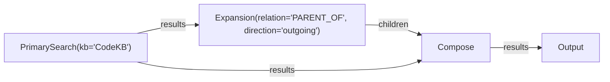

Ce Mermaid se parse en :
- 4 nœuds : PrimarySearch, Expansion, Compose, Output
- 4 arêtes typées (les labels `|results|`, `|children|` = noms de ports)
- Les configs entre parenthèses = paramètres du nœud

### Syntaxe

Convention de nommage dans le Mermaid :

```
NodeId["NodeType(param1='value1', param2='value2')"]
```

- `NodeId` — identifiant unique dans le graphe (camelCase)
- `NodeType` — type de nœud dans le `NodeRegistry` (PrimarySearch, FetchRelated, Compose, LLMExtract, etc.)
- `param=value` — config du nœud, passée au `NodeFactory::create(config)`
- Label d'arête `|port_name|` — nom du port de sortie/entrée

Si le label d'arête est omis, le port par défaut est `"output"` → `"input"` :

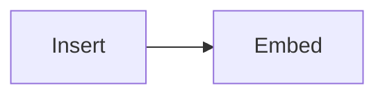

Équivaut à `A.output → B.input`.

### Parsing Mermaid → DataflowGraph

```rust
pub struct MermaidParser {
    registry: Arc<NodeRegistry>,
}

impl MermaidParser {
    /// Parse un string Mermaid en DataflowGraph
    pub fn parse(&self, mermaid: &str) -> Result<DataflowGraph, ParseError> {
        let (nodes, edges) = parse_mermaid_syntax(mermaid)?;

        let mut graph = DataflowGraph::new();
        for (id, node_type, config) in nodes {
            let factory = self.registry.get(&node_type)?;
            let node = factory.create(config)?;
            graph.add_node(id, node);
        }
        for (from_id, from_port, to_id, to_port) in edges {
            graph.connect((from_id, &from_port), (to_id, &to_port))?;
        }
        graph.validate()?;  // vérifie types, cycles, ports manquants
        Ok(graph)
    }
}
```

Le parser n'a pas besoin d'être un parser Mermaid complet — juste le sous-ensemble `graph LR/TD` avec les nœuds `["..."]` et les arêtes `-->|label|`.

### Templates pour end users

On fournit 3-4 templates Mermaid prêts à l'emploi que les users copient et modifient.

#### Template 1 : Search simple (pas d'expansion)

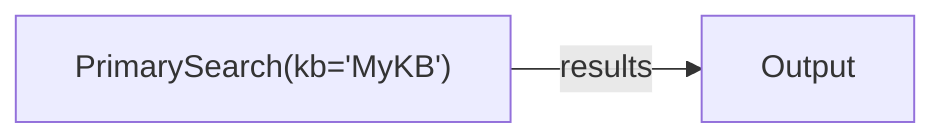

Usage : recherche basique sans expansion. L'utilisateur change `kb='MyKB'` par son KB.

#### Template 2 : Search avec expansion (le plus commun)

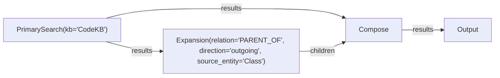

Usage : cherche des Classes, ramène leurs méthodes (enfants via PARENT_OF). L'utilisateur change la relation et le source_entity.

#### Template 3 : Search avec double expansion (matched + others)

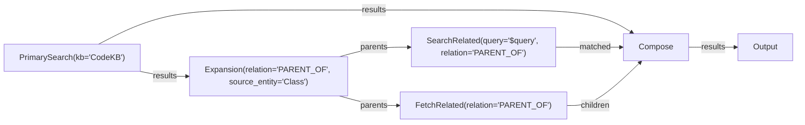

Usage : cherche des Classes, fait un SearchRelated (quels enfants matchent la query) + FetchRelated (tous les enfants), puis Compose assigne `matched_children` et `other_children`. Le pattern "exclude" du doc 08 est un template standard.

Note : `$query` est une variable substituée au runtime par la query de recherche.

#### Template 4 : Ingestion avec normalisation LLM

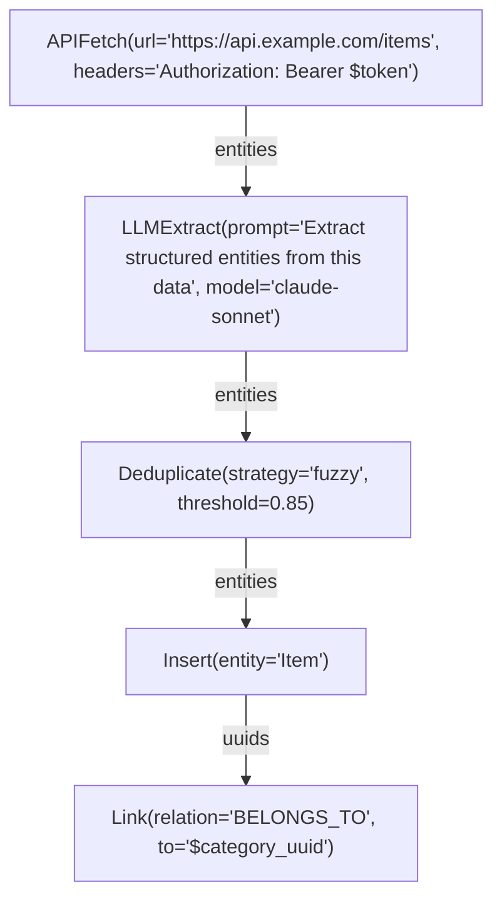

Usage : fetch une API, normalise avec un LLM, déduplique, insère. L'utilisateur modifie l'URL, le prompt, la strategy de dédup.

### Variables dans les templates

Les templates supportent des variables `$variable` substituées au runtime :

```rust
pub struct PipelineInstance {
    graph: DataflowGraph,
    variables: HashMap<String, String>,
}

impl PipelineInstance {
    pub fn from_mermaid(mermaid: &str, vars: HashMap<String, String>) -> Result<Self, Error> {
        let resolved = substitute_variables(mermaid, &vars)?;
        let graph = MermaidParser::new(registry).parse(&resolved)?;
        Ok(Self { graph, variables: vars })
    }
}
```

Côté API :

```json
{
  "pipeline": "search_with_expansion",
  "variables": {
    "query": "authentication",
    "kb": "CodeKB",
    "relation": "PARENT_OF",
    "source_entity": "Class"
  }
}
```

### Validation et messages d'erreur

Le parser produit des erreurs lisibles pour les end users :

```
Error in pipeline "my_search.mmd" line 3:
  Expand["Expansion(relation='PARENT_OF')"] -->|foobar| Compose

  Port "foobar" does not exist on node "Expansion".
  Available output ports: children, parents

  Hint: did you mean "children"?
```

```
Error in pipeline "my_search.mmd":
  Node "Compose" has required input port "results" that is not connected.

  Hint: connect PrimarySearch.results → Compose.results
```

La validation se fait à la construction du graphe (avant l'exécution), donc les erreurs sont reportées immédiatement.

### Relation avec le JSON et l'éditeur visuel

Trois formats pour le même graphe, convertibles entre eux :

```
Mermaid (.mmd)  ←→  JSON (sérialisation)  ←→  Éditeur visuel (UI)
     ↓                      ↓                         ↓
  end users            programmatic API           drag & drop
  (text editor)        (REST, SDK)                (frontend)
```

- **Mermaid → JSON** : `MermaidParser::parse()` → `DataflowGraph` → `serde_json::to_string()`
- **JSON → Mermaid** : `DataflowGraph::to_mermaid()` — génère le Mermaid depuis le graphe
- **JSON ↔ Éditeur** : le frontend charge/sauve du JSON, avec positions x/y en metadata

Les trois formats sont des vues du même modèle. L'utilisateur choisit celui qu'il préfère.

### Avantages du Mermaid-as-DSL

1. **Zéro courbe d'apprentissage** — les devs connaissent déjà Mermaid
2. **Renderable partout** — GitHub, VS Code, documentation, README
3. **Versionnable** — diff lisible dans les PRs
4. **Copier-coller** — les templates sont des blocs de texte, pas des UIs
5. **Self-documenting** — le pipeline est sa propre documentation
6. **Validable** — erreurs claires avant l'exécution
7. **Pas de vendor lock-in** — Mermaid est un standard ouvert

### Graphe-as-Node : composabilité récursive

Un graphe Mermaid **est lui-même un Node**. Ses ports d'entrée/sortie sont **déduits automatiquement** des bords libres du sous-graphe.

#### Déduction des ports

Un port d'entrée du graphe = un port d'entrée d'un nœud interne qui n'est connecté à aucun port de sortie interne (bord libre entrant).

Un port de sortie du graphe = un port de sortie d'un nœud interne qui n'est connecté à aucun port d'entrée interne (bord libre sortant).

```rust
impl DataflowGraph {
    /// Déduit les ports exposés du graphe (bords libres)
    pub fn exposed_ports(&self) -> (Vec<PortDef>, Vec<PortDef>) {
        let mut inputs = vec![];
        let mut outputs = vec![];

        for node in &self.nodes {
            for port in node.inputs() {
                // Si aucun edge interne n'alimente ce port → c'est un input du graphe
                if !self.edges.iter().any(|e| e.to == (node.id, port.name)) {
                    inputs.push(PortDef {
                        name: format!("{}.{}", node.name(), port.name).leak(),
                        value_type: port.value_type.clone(),
                        required: port.required,
                    });
                }
            }
            for port in node.outputs() {
                // Si aucun edge interne ne consomme ce port → c'est un output du graphe
                if !self.edges.iter().any(|e| e.from == (node.id, port.name)) {
                    outputs.push(PortDef {
                        name: format!("{}.{}", node.name(), port.name).leak(),
                        value_type: port.value_type.clone(),
                        required: false,
                    });
                }
            }
        }
        (inputs, outputs)
    }
}
```

#### GraphNode — un graphe wrappé en Node

```rust
pub struct GraphNode {
    name: String,
    graph: DataflowGraph,
    inputs: Vec<PortDef>,    // déduits
    outputs: Vec<PortDef>,   // déduits
}

impl GraphNode {
    pub fn from_mermaid(name: &str, mermaid: &str, registry: &NodeRegistry) -> Result<Self, Error> {
        let graph = MermaidParser::new(registry).parse(mermaid)?;
        let (inputs, outputs) = graph.exposed_ports();
        Ok(Self { name: name.to_string(), graph, inputs, outputs })
    }
}

#[async_trait]
impl Node for GraphNode {
    fn name(&self) -> &str { &self.name }
    fn inputs(&self) -> &[PortDef] { &self.inputs }
    fn outputs(&self) -> &[PortDef] { &self.outputs }

    async fn execute(&self, ctx: &mut NodeContext) -> Result<(), NodeError> {
        // 1. Injecter les inputs du GraphNode dans les ports libres internes
        // 2. Exécuter le sous-graphe (sub-runtime)
        // 3. Collecter les outputs des ports libres sortants
        let mut sub_runtime = DataflowRuntime::new(self.graph.clone(), ctx.services);
        for (port, value) in ctx.drain_inputs() {
            sub_runtime.inject_input(&port, value)?;
        }
        sub_runtime.execute().await?;
        for (port, value) in sub_runtime.collect_outputs() {
            ctx.output_raw(&port, value)?;
        }
        Ok(())
    }
}
```

#### Exemple : sous-pipeline réutilisable

Définir un sous-pipeline "ExpandAndCompose" :

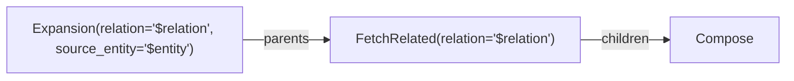

Ports déduits :
- **Inputs** : `Expand.results` (non connecté en entrée), `Compose.results` (non connecté en entrée)
- **Outputs** : `Compose.results` (non connecté en sortie)

Utilisation dans un graphe parent :

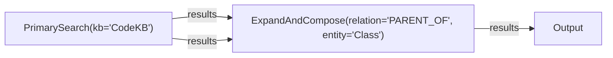

`ExpandAndCompose` est un `GraphNode` — il apparaît comme un seul nœud dans le graphe parent, mais en interne c'est un sous-graphe de 3 nœuds. La runtime exécute le sous-graphe de manière transparente.

#### Nommage des ports exposés

Convention pour les ports déduits : `noeud_interne.port`. Mais souvent on veut des noms plus propres. Le Mermaid supporte des annotations de port explicites :

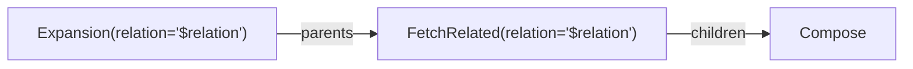

Les annotations `@expose_input`/`@expose_output` avec `as alias` renomment les ports exposés. Sans annotations, les noms sont déduits automatiquement avec le format `node.port`.

#### Récursivité

Un `GraphNode` peut contenir d'autres `GraphNode`. La runtime détecte les cycles de sous-graphes à la construction (pas de récursion infinie).

```
MainPipeline (GraphNode)
  └── ExpandAndCompose (GraphNode)
       ├── Expansion (Node)
       ├── FetchRelated (Node)
       └── Compose (Node)
```

L'exécution est plate : le sous-graphe est "inliné" dans le graphe parent au moment de la construction (ou exécuté comme sub-runtime — au choix d'implémentation).

**Option A : Inlining** — le sous-graphe est aplati dans le graphe parent, les nœuds internes deviennent des nœuds normaux. Plus performant (pas de sub-runtime), mais perd l'encapsulation (les nœuds internes sont visibles).

**Option B : Sub-runtime** — le sous-graphe s'exécute dans sa propre runtime. Plus propre (encapsulation), permet le retry au niveau du sous-graphe, mais overhead mémoire.

**Recommandation : Option A pour la search (performance), Option B pour les pipelines d'ingestion longs (isolation, retry).** Le `GraphNode` pourrait avoir un flag `inline: bool`.

#### Enregistrement dans le NodeRegistry

```rust
// Les GraphNode sont des NodeFactory comme les autres
registry.register("ExpandAndCompose", GraphNodeFactory {
    mermaid: include_str!("templates/expand_and_compose.mmd"),
    variables: vec!["relation", "entity"],
});

// → utilisable dans d'autres Mermaid comme n'importe quel node type
```

Un fichier `.mmd` dans un dossier `templates/` est automatiquement enregistré comme un type de nœud disponible. Les end users peuvent ajouter leurs propres templates — chaque `.mmd` devient un nœud réutilisable.

---

## Exécution : Runtime

### Algorithme

```rust
pub struct DataflowRuntime {
    graph: DataflowGraph,
    node_states: HashMap<NodeId, NodeState>,
    port_data: HashMap<(NodeId, &'static str), PortValue>,
    event_tx: broadcast::Sender<DataflowEvent>,
    services: ServiceRegistry,
    max_iterations: usize,
}

enum NodeState {
    Pending,       // inputs pas encore disponibles
    Ready,         // tous les inputs requis sont disponibles
    Running,       // en cours d'exécution
    Completed,     // terminé
    Failed(String),
}
```

```
loop {
    // 1. Trouver les nœuds Ready (tous les inputs required disponibles)
    let ready_nodes = find_ready_nodes();
    if ready_nodes.is_empty() {
        if all_completed() { break Ok(()); }
        else { break Err("deadlock: nœuds pending sans inputs"); }
    }

    // 2. Exécuter en parallèle (tokio::join ou JoinSet)
    for node in ready_nodes {
        let inputs = collect_inputs(node);
        let mut ctx = NodeContext::new(inputs, &services, &mut graph_emitter);
        node.execute(&mut ctx).await?;
        store_outputs(node, ctx.outputs);
    }

    // 3. Intégrer les nœuds dynamiques émis
    if graph_emitter.has_new_nodes() {
        integrate_dynamic_nodes(graph_emitter.drain());
        // → re-tri topologique pour les nœuds ajoutés
    }

    iteration += 1;
    if iteration > max_iterations { break Err("max_iterations"); }
}
```

### Parallélisme

Les nœuds au même niveau topologique (pas de dépendance entre eux) s'exécutent en parallèle. Exemple :

```
Niveau 0: PrimarySearch
Niveau 1: Expansion
Niveau 2: FetchRelated(A), FetchRelated(B), SearchRelated(A)  ← parallèle
Niveau 3: Compose
```

### Fan-out / Fan-in

**Fan-out** : un port de sortie connecté à plusieurs ports d'entrée → la valeur est clonée.

```
PrimarySearch.results ──→ Expansion.results
PrimarySearch.results ──→ Compose.results
```

**Fan-in** : plusieurs ports de sortie connectés au même port d'entrée → merge automatique.

Pour les Children :
```
FetchRelated(A).children ──→┐
FetchRelated(B).children ──→├──→ Compose.children  (HashMap merge)
SearchRelated.matched ─────→┘
```

Le merge dépend du `PortType` :
- `Results` : concat
- `Children` : HashMap merge (par source_uuid)
- `Uuids` : concat + dedup
- `Map` : deep merge

```rust
impl PortValue {
    pub fn merge(self, other: PortValue) -> Result<PortValue, MergeError> {
        match (self, other) {
            (PortValue::Results(mut a), PortValue::Results(b)) => {
                a.extend(b); Ok(PortValue::Results(a))
            }
            (PortValue::Children(mut a), PortValue::Children(b)) => {
                for (k, v) in b { a.entry(k).or_default().extend(v); }
                Ok(PortValue::Children(a))
            }
            _ => Err(MergeError::IncompatibleTypes),
        }
    }
}
```

---

## Batching

L'ingestion traite des milliers d'entités. Chaque nœud doit pouvoir traiter en batch.

### Option A : Batch comme paramètre du nœud

Le nœud déclare un `batch_size` et la runtime le nourrit par chunks :

```rust
pub trait BatchNode: Node {
    fn batch_size(&self) -> usize;
    // La runtime appelle execute() N fois avec des sous-ensembles
}
```

### Option B : Le nœud gère son propre batching

Le nœud reçoit tout et batch en interne. C'est le pattern actuel de l'OperationQueue.

**Recommandation : Option B.** Le nœud sait mieux que la runtime comment optimiser (ex: InsertNode fait des UNWIND Cypher avec 50 items, EmbedNode fait des batches GPU de 32). La runtime ne batch pas — elle passe tout et le nœud découpe.

---

## Services partagés

Certains nœuds ont besoin d'accès à des ressources partagées (DB, catalog, embedder, LLM). Au lieu de les passer dans le contexte global (couplage), on utilise un registry typé :

```rust
pub struct ServiceRegistry {
    services: HashMap<TypeId, Box<dyn Any + Send + Sync>>,
}

impl ServiceRegistry {
    pub fn register<S: Send + Sync + 'static>(&mut self, service: S);
    pub fn get<S: Send + Sync + 'static>(&self) -> Option<&S>;
}
```

Les nœuds demandent les services dont ils ont besoin :

```rust
async fn execute(&self, ctx: &mut NodeContext) -> Result<(), NodeError> {
    let catalog = ctx.service::<Arc<Mutex<Catalog>>>()?;
    let db = ctx.service::<Arc<dyn DbConnection>>()?;
    // ...
}
```

---

## Données en transit : sérialisation, persistance, observabilité

### PortValue est Serialize + Deserialize

Fondation : `PortValue` doit être sérialisable. Tous les types internes (`UnifiedResult`, `ChildSummary`, `CypherValue`) ont déjà `#[derive(Serialize)]`. On ajoute `Deserialize` :

```rust
#[derive(Debug, Clone, Serialize, Deserialize)]
pub enum PortValue {
    Results(Vec<UnifiedResult>),
    Children(HashMap<String, Vec<ChildSummary>>),
    Uuids(Vec<String>),
    Entities(Vec<BTreeMap<String, CypherValue>>),
    Relation(String),
    Query(String),
    Map(BTreeMap<String, CypherValue>),
    Any(serde_json::Value),
    Empty,
}
```

Formats supportés :
- **JSON** — interop, debug humain, API REST, stockage lisible
- **MessagePack** (`rmp-serde`) — compact, rapide, pour le cache et la persistance interne
- **Bincode** — encore plus compact, pour les gros volumes (ingestion)

La runtime choisit le format selon le contexte. Les events de debug utilisent JSON (lisible), le cache utilise MessagePack (perf).

### Trois niveaux d'observabilité

#### Niveau 1 : Summary (défaut, production)

Ce qu'on a déjà dans les events : juste des compteurs.

```rust
NodeCompleted {
    node_id: 3,
    name: "FetchRelated",
    duration_ms: 12,
    outputs: vec![("children", "5 parents, 12 children")],
}
```

Zéro overhead — pas de sérialisation des données.

#### Niveau 2 : Tap (debug, développement)

Un **Tap** est un point d'écoute sur une arête. On souscrit aux données complètes qui transitent sur une connexion spécifique :

```rust
impl DataflowRuntime {
    /// Pose un tap sur une arête — les données seront sérialisées et émises
    pub fn tap(&mut self, from: (NodeId, &str), to: (NodeId, &str)) -> TapReceiver;

    /// Tap toutes les arêtes (mode full debug)
    pub fn tap_all(&mut self) -> TapReceiver;
}

pub enum TapEvent {
    Data {
        from: (NodeId, String),
        to: (NodeId, String),
        value: serde_json::Value,   // données complètes sérialisées
        timestamp: Instant,
    },
}
```

Usage :

```rust
let tap = runtime.tap(("primary_search", "results"), ("expansion", "results"));
runtime.execute().await?;

// Après exécution, lire ce qui a transité
for event in tap.drain() {
    println!("Data: {}", serde_json::to_string_pretty(&event.value)?);
}
```

Pour l'éditeur visuel : le frontend pose des taps sur les arêtes que l'utilisateur clique, et affiche les données en temps réel.

Le coût n'est payé que sur les arêtes tappées — pas de sérialisation si pas de tap.

#### Niveau 3 : Record (replay, audit)

Enregistre **toutes** les données de **toutes** les arêtes. Permet le replay exact d'une exécution.

##### Stockage dans rag3db

On a un graph DB — autant s'en servir. Les traces d'exécution deviennent des nœuds et relations queryables en Cypher, dans un schema dédié.

**Schema :**

```
(_DataflowExecution)
  │ properties: pipeline_name, pipeline_mermaid, status, duration_ms, created_at, variables (JSON)
  │
  ├──[:HAS_NODE]──→ (_DataflowNodeRun)
  │                   properties: node_name, node_type, status, duration_ms,
  │                               round, inputs_summary, outputs_summary,
  │                               inputs (JSON), outputs (JSON), error
  │
  └──[:HAS_EDGE]──→ (_DataflowEdgeRun)
                      properties: from_node, from_port, to_node, to_port,
                                  value_summary, value (JSON), ts_ms
```

Relations supplémentaires :

```
(_DataflowNodeRun)──[:PRODUCED]──→(_DataflowEdgeRun)   // le nœud qui a produit cette donnée
(_DataflowNodeRun)──[:CONSUMED]──→(_DataflowEdgeRun)   // le nœud qui a consommé cette donnée
(_DataflowExecution)──[:PRODUCED_RESULT]──→(Entity)     // lien vers les entités créées/trouvées
```

La dernière relation `PRODUCED_RESULT` est la clé : elle lie une exécution de pipeline aux entités qu'elle a produites (ingestion) ou trouvées (search). On peut répondre à "quelle pipeline a créé cette entité ?" ou "quelles recherches ont trouvé ce résultat ?".

**Écriture :**

```rust
pub struct DataflowRecorder {
    conn: Arc<dyn DbConnection>,
    execution_uuid: String,
    /// Niveau de détail : Summary (pas de JSON data), Full (tout)
    detail: RecordDetail,
}

pub enum RecordDetail {
    /// Seulement les summaries (node name, duration, counts)
    Summary,
    /// Summaries + données JSON sur les edges
    Full,
    /// Rien (pas de recording)
    None,
}
```

Le recorder écrit dans rag3db **après** l'exécution complète (pas pendant — pour ne pas ralentir le pipeline). En un seul batch Cypher :

```cypher
// 1. Créer l'exécution
CREATE (e:_DataflowExecution {
    _uuid: $exec_uuid,
    pipeline_name: $name,
    pipeline_mermaid: $mermaid,
    status: "completed",
    duration_ms: $duration,
    created_at: $ts,
    variables: $vars_json
})

// 2. Créer les node runs (UNWIND)
WITH e
UNWIND $nodes AS n
CREATE (nr:_DataflowNodeRun {
    _uuid: n.uuid,
    node_name: n.name,
    node_type: n.type,
    status: n.status,
    duration_ms: n.duration,
    round: n.round,
    inputs_summary: n.inputs_summary,
    outputs_summary: n.outputs_summary,
    inputs: n.inputs_json,
    outputs: n.outputs_json
})
CREATE (e)-[:HAS_NODE]->(nr)

// 3. Créer les edge runs (UNWIND)
// 4. Créer les relations PRODUCED/CONSUMED
```

**Queries utiles :**

```cypher
// Les 10 dernières exécutions du pipeline "search_expand"
MATCH (e:_DataflowExecution {pipeline_name: "search_expand"})
RETURN e ORDER BY e.created_at DESC LIMIT 10

// Temps moyen par nœud sur les 100 dernières recherches
MATCH (e:_DataflowExecution)-[:HAS_NODE]->(n:_DataflowNodeRun)
WHERE e.pipeline_name = "search_expand"
RETURN n.node_type, avg(n.duration_ms), count(*)
ORDER BY avg(n.duration_ms) DESC

// Quelle pipeline a trouvé cette entité ?
MATCH (e:_DataflowExecution)-[:PRODUCED_RESULT]->(entity {_uuid: $uuid})
RETURN e.pipeline_name, e.created_at, e.variables

// Replay : récupérer les inputs d'un nœud pour re-exécuter
MATCH (e:_DataflowExecution {_uuid: $exec_uuid})-[:HAS_NODE]->(n {node_name: "LLMExtract"})
RETURN n.inputs

// Comparer deux exécutions nœud par nœud
MATCH (e1:_DataflowExecution {_uuid: $uuid1})-[:HAS_NODE]->(n1)
MATCH (e2:_DataflowExecution {_uuid: $uuid2})-[:HAS_NODE]->(n2)
WHERE n1.node_name = n2.node_name
RETURN n1.node_name, n1.duration_ms, n2.duration_ms,
       n1.outputs_summary, n2.outputs_summary
```

**Rétention :**

Les traces s'accumulent. Politique de rétention configurable :

```rust
pub struct RecordRetention {
    /// Garder les N dernières exécutions par pipeline
    pub max_per_pipeline: Option<usize>,       // ex: 100
    /// Supprimer les exécutions plus vieilles que N jours
    pub max_age_days: Option<u32>,              // ex: 30
    /// Garder les données JSON (Full) seulement pour les N dernières
    pub full_detail_count: Option<usize>,       // ex: 10
    /// Toujours garder les exécutions en erreur
    pub keep_errors: bool,                      // true
}
```

Au-delà du seuil, les anciennes exécutions sont soit supprimées, soit dégradées (Full → Summary : on garde les durées et compteurs, on supprime les JSON de données).

##### JSONL en fallback

Pour les cas sans rag3db (tests unitaires, debug local, export), le recorder peut aussi écrire en JSONL fichier :

```jsonl
{"type":"execution","uuid":"exec-1","pipeline":"search_expand","ts":1709683200}
{"type":"node","uuid":"n-1","name":"PrimarySearch","status":"completed","duration_ms":12,"outputs_summary":"3 results"}
{"type":"edge","from":["PrimarySearch","results"],"to":["Expansion","results"],"value":[{"uuid":"abc","score":0.95}],"ts_ms":12}
```

Le JSONL est importable dans rag3db a posteriori (`LOAD FROM` + Cypher), et c'est le format de transport pour exporter/importer des traces entre instances.

```rust
pub enum RecordSink {
    /// Écriture directe dans rag3db (recommandé)
    Database(Arc<dyn DbConnection>),
    /// Fichier JSONL (fallback / export)
    File(PathBuf),
    /// Les deux
    Both(Arc<dyn DbConnection>, PathBuf),
    /// Rien
    None,
}
```

Ce qui donne :
- **Replay** : query rag3db pour récupérer les inputs, re-exécuter le pipeline
- **Diff** : comparer deux `_DataflowExecution` en Cypher
- **Audit** : traçabilité complète queryable
- **Tests snapshot** : vérifier que la sortie ne change pas après un refactoring
- **Analytics** : temps moyen par nœud, taux d'erreur, pipelines les plus lents
- **Lineage** : remonter de n'importe quelle entité vers la pipeline qui l'a créée

### Persistance : Checkpoints

Pour les pipelines longs (ingestion de 100K entités, étapes LLM coûteuses), on veut pouvoir reprendre après un crash.

```rust
pub struct Checkpoint {
    /// État de chaque nœud
    node_states: HashMap<NodeId, NodeState>,
    /// Données produites par les nœuds complétés (port → valeur sérialisée)
    completed_outputs: HashMap<(NodeId, String), Vec<u8>>,  // MessagePack
    /// Graphe (y compris les nœuds dynamiques émis)
    graph_snapshot: DataflowGraph,
    /// Timestamp
    created_at: SystemTime,
}

impl DataflowRuntime {
    /// Sauve un checkpoint après chaque nœud complété
    pub fn enable_checkpoints(&mut self, dir: PathBuf, strategy: CheckpointStrategy);

    /// Reprend depuis un checkpoint
    pub fn resume_from(checkpoint: Checkpoint, services: ServiceRegistry) -> Result<Self, Error>;
}

pub enum CheckpointStrategy {
    /// Checkpoint après chaque nœud (sûr, overhead IO)
    EveryNode,
    /// Checkpoint après chaque niveau topologique (bon compromis)
    EveryLevel,
    /// Checkpoint seulement après certains nœuds (par nom/type)
    After(Vec<String>),
    /// Pas de checkpoint
    None,
}
```

À la reprise, la runtime :
1. Charge le graphe depuis le checkpoint
2. Marque les nœuds déjà complétés
3. Restaure leurs outputs depuis les données sérialisées
4. Continue l'exécution à partir des nœuds pending

#### Cas d'usage checkpoint : étapes LLM

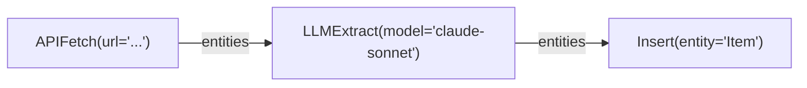

`LLMExtract` coûte cher (tokens, temps). Si `Insert` crash, on ne veut pas re-payer le LLM. Avec `CheckpointStrategy::After(vec!["LLMExtract"])`, les outputs de LLMExtract sont persistés — la reprise skip directement à Insert.

### Cache par nœud

Différent du checkpoint (qui sauve l'état global), le **cache par nœud** mémoïse les résultats d'un nœud en fonction de ses inputs.

```rust
pub trait CacheableNode: Node {
    /// Clé de cache dérivée des inputs (hash)
    fn cache_key(&self, inputs: &HashMap<&str, &PortValue>) -> Option<String>;
}
```

```rust
pub struct NodeCache {
    dir: PathBuf,
    // Structure: {dir}/{node_type}/{cache_key}.msgpack
}

impl NodeCache {
    pub fn get(&self, node_type: &str, key: &str) -> Option<HashMap<String, PortValue>>;
    pub fn put(&self, node_type: &str, key: &str, outputs: &HashMap<String, PortValue>);
    pub fn invalidate(&self, node_type: &str);
}
```

La runtime vérifie le cache avant d'exécuter un nœud :

```
1. Calculer cache_key depuis les inputs
2. Si cache hit → skip l'exécution, utiliser les outputs cachés
3. Si cache miss → exécuter, stocker les outputs dans le cache
```

Utile pour :
- **LLM** : même prompt + mêmes données = même résultat, pas besoin de re-appeler
- **Embed** : même texte = même vecteur
- **FetchRelated** : même UUID + même relation = mêmes enfants (si le graph n'a pas changé)
- **APIFetch** : même URL = mêmes données (avec TTL)

Le cache est **opt-in** par nœud (implémenter `CacheableNode`) et **invalidable** globalement ou par type.

### Snapshot testing

Le recording + la sérialisation permettent du **snapshot testing** natif :

```rust
#[test]
async fn test_search_pipeline_snapshot() {
    let runtime = build_search_pipeline("CodeKB", "auth", expansion_rules);

    // Exécuter et enregistrer
    let recording = runtime.execute_with_recording().await?;

    // Comparer avec le snapshot sauvegardé
    assert_snapshot!(recording, "search_auth_expand_parent_of");
}
```

Le snapshot contient le graphe + toutes les données en transit. Si un refactoring change le comportement d'un nœud, le diff du snapshot montre exactement quelles données ont changé et sur quelle arête.

### API d'inspection pour l'éditeur visuel

L'éditeur visuel a besoin d'inspecter les données après exécution :

```rust
impl DataflowRuntime {
    /// Après exécution : lire les outputs d'un nœud
    pub fn node_output(&self, node_id: NodeId, port: &str) -> Option<&PortValue>;

    /// Après exécution : lire toutes les données qui ont transité sur une arête
    pub fn edge_data(&self, edge: &Edge) -> Option<&PortValue>;

    /// Export complet pour le frontend
    pub fn execution_report(&self) -> ExecutionReport;
}

#[derive(Serialize)]
pub struct ExecutionReport {
    pub graph: SerializedGraph,
    pub nodes: Vec<NodeReport>,
    pub edges: Vec<EdgeReport>,
    pub duration_ms: u64,
}

#[derive(Serialize)]
pub struct NodeReport {
    pub id: NodeId,
    pub name: String,
    pub state: String,          // "completed", "failed", etc.
    pub duration_ms: u64,
    pub outputs: HashMap<String, serde_json::Value>,  // données sérialisées
}

#[derive(Serialize)]
pub struct EdgeReport {
    pub from: (NodeId, String),
    pub to: (NodeId, String),
    pub value_summary: String,
    pub value: Option<serde_json::Value>,  // None si pas en mode debug
}
```

Le frontend appelle `execution_report()` après une exécution et rend :
- Chaque nœud coloré selon son état (vert/rouge/gris)
- Durée affichée sur chaque nœud
- Clic sur une arête → affiche les données en JSON
- Clic sur un nœud → affiche ses inputs/outputs complets

### Streaming vs batch

Pour les pipelines courts (search), l'exécution est batch : on exécute tout, on collecte les résultats à la fin.

Pour les pipelines longs (ingestion de 100K items), on veut du **streaming** : les données coulent au fur et à mesure, nœud par nœud, sans tout garder en mémoire.

```rust
pub enum ExecutionMode {
    /// Tout en mémoire, tous les résultats disponibles après exécution
    Batch,
    /// Streaming : les données sont consommées au fur et à mesure
    /// Les ports de sortie sont des channels, pas des valeurs stockées
    Stream {
        buffer_size: usize,  // backpressure
    },
}
```

En mode Stream, les arêtes deviennent des channels (`tokio::mpsc`). Un nœud peut commencer à consommer ses inputs avant que le nœud précédent ait fini de tout produire. Le backpressure est géré par la taille du buffer.

Le mode Stream est **incompatible** avec le checkpoint simple (il faudrait un write-ahead log). Pour la Phase 1, on fait du batch uniquement. Le streaming viendra plus tard si l'ingestion en a besoin.

### Résumé des niveaux

| Niveau | Quand | Quoi | Stockage | Coût |
|--------|-------|------|----------|------|
| Summary | Production | Compteurs dans les events | Events broadcast | Zéro |
| Tap | Debug ciblé | Données complètes sur 1-N arêtes | Mémoire (channel) | Par arête tappée |
| Record | Replay / audit | Tout | rag3db (`_DataflowExecution`) ou JSONL | Batch Cypher post-exec |
| Checkpoint | Pipelines longs | État global après N nœuds | Disque (MessagePack) | IO périodique |
| Cache | Nœuds coûteux | Outputs par nœud, keyed par inputs | Disque + rag3db | Hash + lookup |

---

## Migration progressive

On ne réécrit pas tout d'un coup. Chemin proposé :

### Phase 1 : Framework Core (~3j)

Fichiers :
- `src/dataflow/mod.rs` — Node, PortDef, PortValue, PortType, Edge
- `src/dataflow/graph.rs` — DataflowGraph, NodeId, connect(), validate()
- `src/dataflow/runtime.rs` — DataflowRuntime, execute(), parallélisme
- `src/dataflow/emitter.rs` — GraphEmitter pour DynamicNode
- `src/dataflow/events.rs` — DataflowEvent
- `src/dataflow/services.rs` — ServiceRegistry
- `src/dataflow/observe.rs` — Tap, TapEvent, DataflowRecorder, ExecutionReport

PortValue `Serialize + Deserialize` dès le départ. Tap + Record intégrés dans la runtime.

Tests unitaires : graph construction, topological sort, parallélisme, dynamic nodes, type checking, tap, record/replay.

### Phase 2 : Search sur Dataflow (~2j)

- Ré-implémenter les 4 processors comme des Nodes
- `SearchStrategy` → construit un `DataflowGraph`
- `search_with_strategy()` → instancie la runtime, exécute, collecte les outputs
- Tests E2E identiques (les 5 tests existants doivent passer)

### Phase 3 : SearchRelated + Compose enrichi (~1j)

- `SearchRelatedNode` avec input query + parents, output matched Results
- `ComposeNode` avec inputs multiples (results, children, matched)
- Pattern exclude résolu par le graphe, pas par des callbacks

### Phase 4 : Mermaid Parser + Templates (~2j)

- Parser Mermaid → DataflowGraph (sous-ensemble `graph LR/TD`)
- Substitution de variables `$var`
- Validation avec messages d'erreur lisibles
- 3-4 templates built-in (search simple, expansion, double expansion, ingestion LLM)
- `DataflowGraph::to_mermaid()` pour l'export
- Tests : parse → validate → execute pour chaque template

### Phase 5 : Rhai Nodes (~2j)

- `ScriptNode` + `ScriptDynamicNode`
- Parsing des annotations `@input`/`@output`
- Sandbox Rhai avec builtins exposés
- Tests : script qui filtre, script qui émet des nœuds

### Phase 6 : Ingestion sur Dataflow (~3j, optionnel)

- Migrer l'OperationQueue vers le même framework
- Chaque CatalogOp type → un Node
- Les priorités deviennent l'ordre topologique
- Le batching interne aux nœuds
- RefOrUuid remplacé par des arêtes typées

### Phase 7 : Migrations (~2j)

- Nœuds de migration built-in (RenameField, AddField, Backup, Validate, etc.)
- `MigrationRunner` : pending, apply, rollback, status
- Schema `_DataflowMigration` dans rag3db
- Convention fichiers `migrations/*.mmd`
- Dry-run mode (WriteNode skippé)
- Tests : apply → verify → rollback → verify

### Phase 8 : Éditeur visuel + LLM nodes (~futur)

- Sérialisation JSON des graphes + positions
- NodeRegistry + NodeSchema
- LLMExtractNode, LLMDecideNode
- API pour construire/éditer des graphes depuis le frontend
- Mermaid ↔ JSON ↔ Éditeur : trois vues du même modèle

---

## Migrations de schema (à la Supabase)

### Le problème des migrations Cypher

Cypher n'a pas été conçu pour les migrations. Les problèmes :

1. **Pas de rollback** — un `SET` qui plante à mi-chemin = état incohérent, aucun moyen de revenir en arrière
2. **Pas de dry-run** — impossible de voir ce qu'une migration va faire sans l'exécuter
3. **Pas de traçabilité** — quel Cypher a été exécuté, quand, sur quels nœuds ?
4. **Pas de validation** — une typo dans un label = silent no-op, pas d'erreur
5. **Pas de diff** — impossible de comparer l'état avant/après
6. **Dangereux** — un `MATCH (n) DETACH DELETE n` mal ciblé = données perdues

Les frameworks comme Supabase/Prisma/Flyway résolvent ça avec des tables de migration, des scripts versionnés, et du rollback. Mais ils sont faits pour SQL, pas pour du graph.

### Migrations = Pipelines Dataflow

Avec le framework dataflow, une migration **est** un pipeline. On réutilise tout ce qu'on a : exécution, observabilité, checkpoints, recording dans rag3db.

#### Nœuds de migration built-in

```
QueryNode        — exécute un MATCH Cypher, produit des entités
TransformNode    — transforme les propriétés (rename, merge, convert, compute)
WriteNode        — exécute un SET/CREATE/DELETE Cypher
ValidateNode     — vérifie une assertion (count, schema, contrainte)
BackupNode       — snapshot des données avant modification
```

#### Exemple : renommer un champ

Migration SQL : `ALTER TABLE users RENAME COLUMN firstName TO first_name;`

Migration Cypher brut (dangereux) :
```cypher
MATCH (n:User) SET n.first_name = n.firstName REMOVE n.firstName
```
→ Si ça plante au nœud 5001 sur 10000, la moitié a `first_name`, l'autre a encore `firstName`. Pas de moyen de savoir lesquels.

Migration Dataflow :

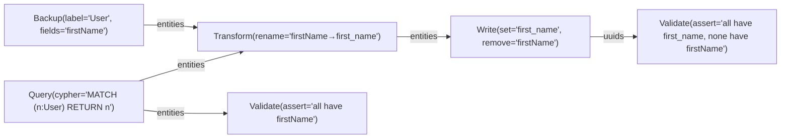

Ce qui se passe :
1. **Backup** — snapshot les valeurs `firstName` actuelles (pour rollback)
2. **Query** — charge tous les User
3. **Validate** — vérifie que tous ont bien `firstName` (pre-condition)
4. **Transform** — renomme le champ en mémoire
5. **Write** — applique les changements en batch (UNWIND + SET)
6. **Verify** — vérifie que la migration est correcte (post-condition)

Le tout enregistré dans `_DataflowExecution` avec le lineage.

#### Dry-run

Mode dry-run = exécuter le pipeline **sans le WriteNode**. On voit exactement ce qui va changer :

```rust
pub enum MigrationMode {
    /// Exécute tout, y compris les écritures
    Apply,
    /// Exécute tout sauf les WriteNode — montre ce qui serait modifié
    DryRun,
    /// Rollback depuis un backup précédent
    Rollback { execution_uuid: String },
}
```

En dry-run, le WriteNode reçoit ses inputs, log ce qu'il **ferait**, mais n'écrit rien. L'`ExecutionReport` montre le plan complet :

```
DRY RUN — Migration "rename_firstName_to_first_name"
  Query: 10,247 User entities matched
  Validate: OK — all have firstName
  Transform: 10,247 entities would be modified
  Write: SKIPPED (dry-run) — would SET first_name, REMOVE firstName on 10,247 entities
  Verify: SKIPPED (dry-run)
```

#### Rollback

Le `BackupNode` sauvegarde les valeurs originales dans une table temporaire ou dans le `_DataflowExecution`. Pour rollback :

```rust
// Le backup est stocké dans l'exécution
MATCH (e:_DataflowExecution {_uuid: $exec_uuid})-[:HAS_NODE]->(b {node_type: "Backup"})
RETURN b.outputs  // → JSON avec les valeurs originales
```

Le rollback est lui-même un pipeline :

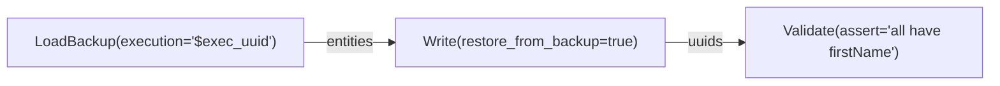

#### Schema de migration tracking

```
(_DataflowMigration)
  properties: version (STRING), name (STRING), status (pending|applied|rolled_back),
              applied_at, rolled_back_at, execution_uuid, pipeline_mermaid, checksum
```

```cypher
// Migrations appliquées, dans l'ordre
MATCH (m:_DataflowMigration) WHERE m.status = "applied"
RETURN m.version, m.name, m.applied_at ORDER BY m.version

// Vérifier si une migration est déjà appliquée
MATCH (m:_DataflowMigration {version: "003", status: "applied"}) RETURN count(m) > 0

// Lier migration → exécution → données modifiées
MATCH (m:_DataflowMigration {version: "003"})-[:EXECUTION]->(e:_DataflowExecution)
MATCH (e)-[:HAS_NODE]->(w {node_type: "Write"})-[:MODIFIED]->(entity)
RETURN count(entity)
```

#### Fichiers de migration

Convention à la Supabase — dossier `migrations/` avec des fichiers ordonnés :

```
migrations/
├── 001_initial_schema.mmd
├── 002_add_user_email.mmd
├── 003_rename_firstName.mmd
├── 004_split_address.mmd
└── 005_add_code_entities.rhai    ← Rhai pour les migrations complexes
```

Chaque fichier est un Mermaid (ou Rhai pour les cas complexes) qui se parse en `DataflowGraph`.

```rust
pub struct MigrationRunner {
    catalog: Arc<Mutex<Catalog>>,
    migrations_dir: PathBuf,
    registry: Arc<NodeRegistry>,
}

impl MigrationRunner {
    /// Liste les migrations pending (pas encore appliquées)
    pub async fn pending(&self) -> Vec<MigrationFile>;

    /// Applique les migrations pending dans l'ordre
    pub async fn apply_all(&self, mode: MigrationMode) -> Vec<MigrationResult>;

    /// Applique une migration spécifique
    pub async fn apply(&self, version: &str, mode: MigrationMode) -> MigrationResult;

    /// Rollback la dernière migration
    pub async fn rollback_last(&self) -> MigrationResult;

    /// Rollback jusqu'à une version
    pub async fn rollback_to(&self, version: &str) -> Vec<MigrationResult>;

    /// Statut de toutes les migrations
    pub async fn status(&self) -> Vec<MigrationStatus>;
}
```

#### Nœuds de migration spécialisés

Au-delà des opérations basiques, des nœuds pour les cas courants :

| Nœud | Usage | Exemple |
|------|-------|---------|
| `RenameField` | Renommer une propriété | `firstName → first_name` |
| `RenameLabel` | Renommer un type d'entité | `User → Account` |
| `AddField` | Ajouter un champ avec valeur par défaut | `email = ""` |
| `RemoveField` | Supprimer un champ (avec backup) | `remove legacy_id` |
| `SplitField` | Séparer un champ en plusieurs | `name → first_name + last_name` |
| `MergeFields` | Fusionner plusieurs champs | `first + last → full_name` |
| `ConvertType` | Convertir le type d'un champ | `age: STRING → INT64` |
| `AddRelation` | Créer des relations depuis un champ | `category_id → BELONGS_TO` |
| `MigrateRelation` | Renommer/restructurer une relation | `HAS_FILE → CONTAINS` |
| `Backfill` | Calculer un champ depuis d'autres | `full_name = first + " " + last` |
| `LLMBackfill` | Remplir un champ via LLM | `summary = LLM(body)` |

Les nœuds de migration sont des `NodeFactory` enregistrées dans le registry — utilisables dans les Mermaid comme n'importe quel nœud.

#### Avantages vs Cypher brut

| Aspect | Cypher brut | Migration Dataflow |
|--------|------------|-------------------|
| Dry-run | Impossible | WriteNode skippé, plan complet affiché |
| Rollback | Manuel (écrire le Cypher inverse) | Automatique depuis BackupNode |
| Traçabilité | Aucune | `_DataflowMigration` + `_DataflowExecution` |
| Validation | Aucune (silent no-op possible) | ValidateNode pre/post conditions |
| État incohérent | Si crash mid-query | Checkpoint + rollback |
| Reprise | Impossible | Resume depuis checkpoint |
| Batch | Tout en une query (ou à la main) | Batch interne aux nœuds |
| Lisibilité | Cypher opaque | Mermaid visuel/textuel |
| Versionning | Scripts SQL-style | Fichiers `.mmd` versionnés |
| Complexe | Cypher multi-statement fragile | Pipeline avec LLM, validation, backup |

---

## Comparaison avec l'existant

| Aspect | SearchQueue actuelle | Dataflow proposé |
|--------|---------------------|------------------|
| Communication inter-ops | Contexte partagé (implicite) | Arêtes typées (explicite) |
| Ordonnancement | Rounds + `.then()` | Tri topologique |
| Parallélisme | Séquentiel par type | Parallèle par niveau |
| Dynamic ops | `.then()` deferred | `DynamicNode` + `GraphEmitter` |
| Extensibilité | Nouveau variant enum + processor | Nouveau Node (trait object) |
| Rhai | Pas encore | ScriptNode natif |
| Visualisation | Events textuels | Graphe sérialisable + events visuels |
| Ingestion | Framework séparé (OperationQueue) | Même framework |
| Typage | Non (shared context) | Oui (PortType sur les arêtes) |
| Testabilité | Monter un contexte entier | Mocker les inputs d'un nœud |
| Définition pipeline | Code Rust uniquement | Mermaid / JSON / Rhai / Code / UI |
| Accessibilité end user | Aucune (API dev only) | Templates Mermaid copier-coller |
| Observabilité données | Logs manuels | Tap/Record/Snapshot par arête |
| Persistance | Aucune | Checkpoints + cache par nœud |
| Replay | Impossible | Record rag3db → replay exact |
| Migrations | Cypher brut sans filet | Pipeline Mermaid, dry-run, rollback, backup |

---

## Questions ouvertes

### Q1 : Granularité des nœuds

Faut-il des nœuds fins (1 FetchRelated = 1 nœud par parent) ou des nœuds gros (1 FetchRelated reçoit tous les parents en batch) ?

- **Fins** : meilleur parallélisme, plus visible dans l'éditeur, mais overhead si 100 parents
- **Gros** : moins d'overhead, mais un nœud qui fait UNWIND sur 100 UUIDs n'est pas parallélisable
- **Recommandation** : nœuds gros par défaut (batch interne), avec option de split pour les cas où le parallélisme importe

### Q2 : Fan-in implicite vs nœud Join explicite

Quand plusieurs arêtes arrivent sur le même port d'entrée, est-ce un merge automatique ou faut-il un nœud Join explicite ?

- **Merge auto** : plus simple à câbler, moins de nœuds dans le graphe
- **Join explicite** : plus visible, custom merge logic possible, mais verbeux
- **Recommandation** : merge auto avec fallback sur JoinNode pour les cas custom. Si 2 arêtes arrivent sur `Compose.children`, la runtime merge les HashMaps automatiquement.

### Q3 : Où mettre les données intermédiaires ?

Quand un nœud produit des données sur un port de sortie, qui les stocke ?

- **A) Dans la runtime** (`port_data: HashMap<(NodeId, port), PortValue>`) — la runtime gère le lifecycle, clone/move quand nécessaire
- **B) Sur l'arête** (chaque Edge a un buffer) — plus proche du modèle dataflow classique
- **Recommandation** : Option A, c'est plus simple en Rust (pas de lifetime sur les arêtes)

### Q4 : Erreurs et retry

Un nœud qui échoue bloque tous ses downstream. Stratégies :

- **A) Fail-fast** : un nœud échoue → tout le graphe échoue
- **B) Retry par nœud** : retry N fois avant de propager l'erreur
- **C) Fallback** : port d'erreur optionnel → nœud de fallback
- **Recommandation** : A pour la search (rapide, pas de retry nécessaire), B pour l'ingestion (retry sur les appels DB/embed)

### Q5 : Faut-il un module dédié ou un crate séparé ?

- **Module `src/dataflow/`** dans rag3weaver — simple, accès direct aux types internes
- **Crate séparé `rag3flow`** — réutilisable hors rag3weaver, mais frontière d'API à maintenir
- **Recommandation** : commencer en module, extraire en crate si ça prend de l'ampleur
