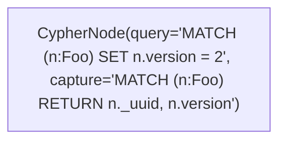
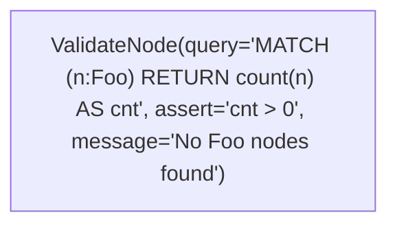
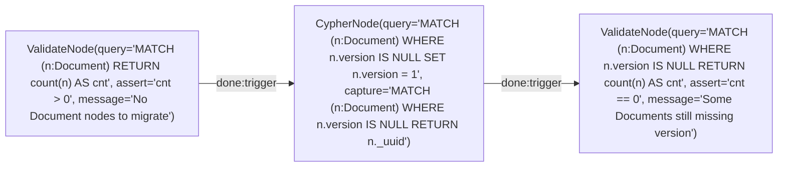

# Doc 16 — Design : Migrations + Undo (Phase 4)

Date : 8 mars 2026

## Objectif

Système de migrations de schéma graph basé sur le framework dataflow, avec undo intégré au niveau du trait Node. Les migrations sont des graphes Mermaid (`.mmd`) exécutés via `DataflowRuntime`, bénéficiant automatiquement du checkpoint (crash recovery) et de l'observabilité (taps, reports).

L'undo n'est pas limité aux migrations : tout nœud qui implémente `undo()` rend son exécution réversible, ce qui ouvre la voie à l'undo/redo applicatif pour les utilisateurs.

## Décisions d'architecture

| Question | Décision | Justification |
|----------|----------|---------------|
| Granularité des nœuds | `CypherNode` + `ValidateNode` (2 nœuds) | 90% des migrations = des queries Cypher. Pas besoin de 5 types. |
| Rollback | Undo intégré au trait Node | Pas de `down.mmd` à maintenir. Undo automatique pour les opérations standard. Override possible. |
| Format | `.mmd` (Mermaid) | Cohérent avec le reste. Supporte migrations complexes (parallélisme, validation). Checkpoint gratuit. |
| Scope | Interne + user-facing | Le runner ne fait pas la différence. Deux répertoires : `migrations/internal/`, `migrations/`. |
| Dry-run | Parse + validate + affiche le plan | Pas de transaction rollback (complexe sur graph DB). Affiche ce que chaque nœud va faire. |
| Verrouillage | `_DataflowMigrationLock` avec TTL | Empêche les apply concurrents. |

## 1. Trait Node — ajout undo

### Nouvelles méthodes (optionnelles, default implementations)

```rust
#[async_trait]
pub trait Node: Send + Sync {
    // --- existant ---
    fn name(&self) -> &str;
    fn inputs(&self) -> &[PortDef];
    fn outputs(&self) -> &[PortDef];
    async fn execute(&mut self, ctx: &mut NodeContext) -> Result<(), String>;
    fn node_type(&self) -> &'static str { "Unknown" }
    fn node_config(&self) -> serde_json::Value { ... }

    // --- nouveau ---
    /// Le nœud supporte-t-il l'undo ?
    fn can_undo(&self) -> bool { false }

    /// Contexte d'undo capturé pendant execute(). Sérialisé dans le checkpoint.
    /// Appelé par le runtime APRÈS execute() réussi.
    fn undo_context(&self) -> Option<serde_json::Value> { None }

    /// Inverse l'opération en utilisant le contexte capturé.
    async fn undo(&mut self, ctx: &mut NodeContext, undo_ctx: serde_json::Value) -> Result<(), String> {
        Err("undo not supported".into())
    }
}
```

### Flux d'exécution avec undo

```
execute() → succès → runtime appelle undo_context()
                    → sérialise dans _DataflowNodeState.undo_json
                    → continue le graphe
```

```
undo (rollback) → runtime charge undo_json depuis le checkpoint
                → reconstruit le nœud via NodeRegistry
                → appelle undo(ctx, undo_ctx) en ordre topo inverse
```

### Impact sur le checkpoint

Ajout d'un champ `undo_json` dans `_DataflowNodeState` :

```sql
CREATE NODE TABLE IF NOT EXISTS _DataflowNodeState(
    _uuid STRING,
    execution_id STRING,
    node_name STRING,
    status STRING,
    output_ports STRING,
    undo_json STRING,        -- NOUVEAU
    duration_ms INT64,
    error STRING,
    completed_at INT64,
    PRIMARY KEY(_uuid))
```

Et dans `NodeCheckpoint` :

```rust
pub struct NodeCheckpoint {
    pub status: NodeCheckpointStatus,
    pub output_ports: HashMap<String, CheckpointPortValue>,
    pub undo_context: Option<serde_json::Value>,  // NOUVEAU
    pub duration_ms: Option<u64>,
    pub error: Option<String>,
    pub completed_at: Option<u64>,
}
```

### Implémentation undo pour les record nodes existants

| Nœud | can_undo | undo_context() | undo() |
|------|----------|----------------|--------|
| InsertRecordNode | true | `Vec<_uuid>` insérés (déjà dans output `inserted`) | `DELETE` par uuid |
| LinkRecordNode | true | `Vec<{from, to, rel_type}>` créés | `DELETE` relations |
| EmbedRecordNode | true | `Vec<_uuid>` embeddés | `SET embedding = NULL, _embed_hash = NULL` |
| ChunkRecordNode | false | — | Non-undoable (stateless transform, chunks supprimés via InsertRecordNode undo) |
| GatherKBNode | false | — | Lecture seule |
| UpdateKBNode | true | `Vec<{uuid, old_values}>` | `SET` anciennes valeurs |
| ChunkKBNode | false | — | Stateless transform |
| FlushFTSNode | true | `kb_name` | `CALL FLUSH_LUCIVY_INDEX(...)` (re-flush) |
| QuerySourceNode | false | — | Lecture seule |
| PrimarySearchNode | false | — | Lecture seule |
| ComposeNode | false | — | Lecture seule |
| FetchRelatedNode | false | — | Lecture seule |

Nœuds lecture seule → `can_undo() = false` car il n'y a rien à inverser (pas de mutation).

## 2. CypherNode

Nœud générique qui exécute une query Cypher. C'est le building block des migrations.

### Config

```rust
pub struct CypherNode {
    name: String,
    query: String,             // query Cypher à exécuter
    capture_query: Option<String>, // query de capture pour undo (optionnel)
    params: serde_json::Value, // paramètres statiques
    undo_data: Option<serde_json::Value>, // capturé pendant execute
}
```

### Config Mermaid



Paramètres :
- `query` (requis) — la mutation Cypher
- `capture` (optionnel) — query SELECT exécutée AVANT la mutation, résultat stocké comme undo context
- `params` (optionnel) — JSON de paramètres passés aux deux queries

### Ports

| Port | Direction | Type | Description |
|------|-----------|------|-------------|
| `trigger` | input | Empty | Déclenche l'exécution (optionnel, pour chaînage) |
| `data` | input | Map | Données d'entrée (optionnel, injectées comme params) |
| `result` | output | Map | Résultat de la query (lignes en JSON) |
| `done` | output | Empty | Signal de complétion |

### Comportement execute()

1. Si `capture_query` est défini : exécuter la capture query → stocker le résultat dans `self.undo_data`
2. Merger les params statiques + input `data` si présent
3. Exécuter `query` avec les params
4. Émettre le résultat sur `result` + signal `done`

### Comportement undo()

1. Charger `undo_data` depuis le `undo_ctx` JSON
2. Si `undo_data` contient des rows : pour chaque row, générer une query de restauration
   - Pour `SET` : restaurer les anciennes valeurs capturées
   - Pour `CREATE` : supprimer par `_uuid`
   - Pour `DELETE` : impossible de restaurer sans capture complète → erreur si pas de capture

### can_undo()

`true` si `capture_query` est défini. Sinon `false` (query fire-and-forget, pas d'undo).

### Undo automatique pour patterns courants

Le CypherNode analyse la query pour déterminer le type d'opération :

| Pattern query | Capture auto-générée | Undo auto-généré |
|---------------|---------------------|-------------------|
| `SET n.prop = $val` | `RETURN n._uuid, n.prop` avant | `SET n.prop = $old_val` |
| `CREATE (n:Type {...})` | capture `_uuid` après | `DELETE n` par uuid |
| `DELETE n` | `RETURN n.*` avant | Non supporté (trop risqué) |
| `MERGE ...` | — | Non supporté (sémantique ambiguë) |

Si la query est trop complexe pour l'analyse auto, l'utilisateur fournit `capture` manuellement.

## 3. ValidateNode

Nœud d'assertion qui vérifie une condition. Fail = arrêt de la migration.

### Config

```rust
pub struct ValidateNode {
    name: String,
    query: String,         // query Cypher qui retourne un résultat
    assertion: Assertion,  // condition à vérifier sur le résultat
    message: String,       // message d'erreur si l'assertion échoue
}
```

### Config Mermaid



### Assertions supportées

```rust
pub enum Assertion {
    CountEquals(i64),      // nombre de lignes retournées == N
    CountGt(i64),          // count > N
    CountLt(i64),          // count < N
    IsEmpty,               // 0 lignes
    IsNotEmpty,            // > 0 lignes
    Expression(String),    // expression sur les colonnes : "cnt > 0"
}
```

Parse depuis la config :
- `assert='count == 5'` → `CountEquals(5)`
- `assert='count > 0'` → `CountGt(0)`
- `assert='empty'` → `IsEmpty`
- `assert='not_empty'` → `IsNotEmpty`
- `assert='cnt > 0'` → `Expression("cnt > 0")`

### Ports

| Port | Direction | Type | Description |
|------|-----------|------|-------------|
| `trigger` | input | Empty | Déclenche la validation |
| `done` | output | Empty | Assertion réussie |

### can_undo() = false

Lecture seule, rien à inverser.

## 4. MigrationRunner

### Schema

```sql
CREATE NODE TABLE IF NOT EXISTS _DataflowMigration(
    _uuid STRING,
    version INT64,
    name STRING,
    status STRING,         -- 'applied', 'failed', 'rolled_back'
    direction STRING,      -- 'up', 'down'
    checksum STRING,       -- BLAKE3 du .mmd
    execution_uuid STRING, -- lien vers _DataflowExecution
    applied_at INT64,
    duration_ms INT64,
    error STRING,
    PRIMARY KEY(_uuid))

CREATE NODE TABLE IF NOT EXISTS _DataflowMigrationLock(
    _uuid STRING,
    locked_by STRING,
    locked_at INT64,
    expires_at INT64,
    PRIMARY KEY(_uuid))
```

### API

```rust
pub struct MigrationRunner {
    conn: Arc<dyn DbConnection>,
    registry: Arc<NodeRegistry>,
    migration_dirs: Vec<PathBuf>,   // répertoires à scanner
}

impl MigrationRunner {
    pub fn new(conn: Arc<dyn DbConnection>, registry: Arc<NodeRegistry>) -> Self;

    /// Ajouter un répertoire de migrations à scanner.
    pub fn add_dir(&mut self, dir: PathBuf);

    /// Lister toutes les migrations (fichier + statut DB).
    pub async fn status(&self) -> Result<Vec<MigrationStatus>, MigrationError>;

    /// Migrations non encore appliquées, triées par version.
    pub async fn pending(&self) -> Result<Vec<MigrationFile>, MigrationError>;

    /// Appliquer les migrations pending (ou jusqu'à `target_version`).
    /// `dry_run = true` : parse + validate + affiche le plan sans exécuter.
    pub async fn apply(
        &self,
        target_version: Option<u64>,
        dry_run: bool,
    ) -> Result<Vec<MigrationResult>, MigrationError>;

    /// Rollback une migration (exécute undo en ordre inverse).
    pub async fn rollback(
        &self,
        version: u64,
    ) -> Result<MigrationResult, MigrationError>;

    /// Vérifie si toutes les migrations pending sont réversibles.
    pub async fn check_reversible(
        &self,
    ) -> Result<Vec<(MigrationFile, bool)>, MigrationError>;
}
```

### Convention de nommage des fichiers

```
migrations/
  001_add_version_field.mmd
  002_rename_entity_type.mmd
  003_add_embedding_index.mmd

migrations/internal/       (rag3weaver internal, auto-applied)
  001_create_dataflow_tables.mmd
  002_add_pipeline_name.mmd
```

Format : `{version}_{name}.mmd`
- `version` : entier, zéro-padded, croissant
- `name` : snake_case, descriptif

### Verrouillage

```
apply() → acquire_lock() → exécuter migrations → release_lock()
```

- Lock = nœud `_DataflowMigrationLock` avec TTL (default 10 min)
- Si lock existe et pas expiré → `MigrationError::Locked { by, since }`
- Si lock expiré → supprimer et reprendre (crash recovery)

### Dry-run

```
apply(dry_run: true) →
  1. Scanner les fichiers .mmd
  2. Parser chaque migration (parse_mermaid_template)
  3. Valider le graphe (from_definition avec le registry)
  4. Vérifier réversibilité (can_undo sur tous les nœuds)
  5. Afficher le plan : nœuds, queries, assertions
  6. NE PAS exécuter
```

Retourne un `Vec<MigrationResult>` avec `status = DryRun` et le plan détaillé.

### Flux d'exécution apply()

```
1. acquire_lock()
2. pending = scan_dirs() - already_applied()
3. sort by version
4. for migration in pending:
   a. parse_mermaid_template(file)
   b. graph = from_definition(def, registry)
   c. runtime = DataflowRuntime::with_services_arc(...)
   d. output = runtime.execute_with_checkpoint(&graph, &store)
   e. store undo contexts in _DataflowNodeState.undo_json
   f. record in _DataflowMigration { status: 'applied', checksum, ... }
5. release_lock()
```

### Flux rollback()

```
1. acquire_lock()
2. load _DataflowMigration { version }
3. load _DataflowNodeState rows for this execution
4. reconstruct nodes via NodeRegistry
5. for each node in REVERSE topo order:
   a. if node.can_undo():
      load undo_json → call node.undo(ctx, undo_ctx)
   b. else:
      error "node {name} does not support undo"
6. update _DataflowMigration { status: 'rolled_back' }
7. release_lock()
```

## 5. Exemple complet

### Migration : ajouter un champ `version` à tous les nœuds `Document`



Undo de cette migration :
- `CypherNode` a capturé les `_uuid` des nœuds modifiés
- `undo()` exécute `MATCH (n:Document) WHERE n._uuid IN $uuids REMOVE n.version`

## 6. Fichiers à créer/modifier

### Nouveaux fichiers

| Fichier | Contenu | ~Lignes |
|---------|---------|---------|
| `src/dataflow/cypher_node.rs` | CypherNode + CypherNodeFactory | ~200 |
| `src/dataflow/validate_node.rs` | ValidateNode + ValidateNodeFactory + Assertion | ~150 |
| `src/dataflow/migrations.rs` | MigrationRunner, MigrationFile, MigrationStatus, MigrationError | ~400 |

### Fichiers modifiés

| Fichier | Modification |
|---------|-------------|
| `src/dataflow/node.rs` | Ajouter `can_undo()`, `undo_context()`, `undo()` au trait Node |
| `src/dataflow/checkpoint.rs` | Ajouter `undo_context` à NodeCheckpoint |
| `src/dataflow/checkpoint_store.rs` | Lire/écrire `undo_json` dans _DataflowNodeState |
| `src/dataflow/runtime.rs` | Après execute() d'un nœud, appeler `undo_context()` et stocker |
| `src/dataflow/node_factories.rs` | Ajouter CypherNodeFactory, ValidateNodeFactory |
| `src/dataflow/mod.rs` | Wire les nouveaux modules + exports |

### Record nodes — ajout undo (fichiers existants)

| Fichier | Ajout |
|---------|-------|
| `src/dataflow/record_nodes.rs` | `can_undo()`, `undo_context()`, `undo()` sur InsertRecordNode, LinkRecordNode, EmbedRecordNode, UpdateKBNode, FlushFTSNode |

## 7. Plan d'implémentation

### Étape 1 — Trait Node + checkpoint undo
- Ajouter les 3 méthodes au trait Node (defaults)
- Ajouter `undo_context` à NodeCheckpoint
- Modifier checkpoint_store pour lire/écrire `undo_json`
- Modifier runtime pour capturer undo_context après execute

### Étape 2 — CypherNode + ValidateNode
- Implémenter CypherNode avec capture query + undo
- Implémenter ValidateNode avec assertions
- Factories + enregistrement dans NodeRegistry
- Tests unitaires (~15)

### Étape 3 — MigrationRunner
- Schema _DataflowMigration + _DataflowMigrationLock
- scan_dirs, pending, status, apply, rollback
- Verrouillage avec TTL
- Dry-run
- Tests unitaires (~15)

### Étape 4 — Undo sur record nodes existants
- InsertRecordNode, LinkRecordNode, EmbedRecordNode, UpdateKBNode
- Tests unitaires (~10)

### Étape 5 — Templates de migration internes
- `migrations/internal/001_create_dataflow_tables.mmd`
- Tests E2E

### Vérification
```bash
cargo test --lib       # ~480+ tests (436 + ~45 nouveaux)
./run_e2e.sh           # 89+ E2E (pas de régression + nouveaux)
```
