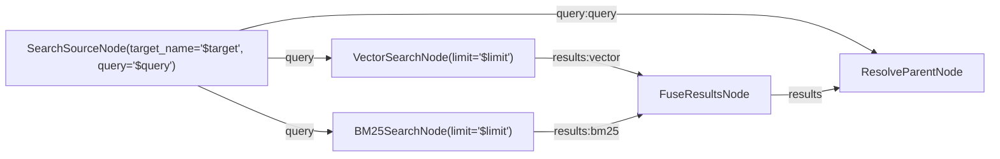

# rag3weaver

RAG pipeline orchestrator for [rag3db](../../README.md). Handles document ingestion, chunking, embedding, and hybrid search — all in Rust, with native and WASM targets.

## Overview

rag3weaver provides two levels of API:

1. **Catalog** — high-level: register entities, ingest data, search. Handles everything internally.
2. **Dataflow** — low-level: composable node-based pipelines for custom search and ingestion workflows.

### Quick Start — Catalog API

```rust
let mut catalog = Catalog::new(conn, embedder, config);
catalog.set_dual_embedder(bge_m3.clone());
catalog.initialize().await?;

// Register a custom entity type
catalog.register_entity("Product", EntityConfig {
    fields: vec![
        SimpleFieldDef::new("name", FieldType::String, FieldRole::Title),
        SimpleFieldDef::new("description", FieldType::Text, FieldRole::Content),
    ],
    signals: SearchSignals::BM25 | SearchSignals::VECTOR,
    ..Default::default()
}).await?;

// Ingest records (auto-chunks, embeds, indexes)
catalog.ingest_entities("Product", vec![
    btree_map!{ "name" => "Rust Book", "description" => "A guide to Rust..." },
]).await?;

// Hybrid search
let response = catalog.search("Product", "rust ownership", SearchOptions {
    consistency: Consistency::Immediate,
    ..Default::default()
}).await?;

for result in &response.results {
    println!("{} (score={:.4})", result.uuid, result.score);
}
```

### Quick Start — Dataflow Pipeline

```rust
let mut graph = DataflowGraph::new();
graph.add_node(Box::new(SearchSourceNode::new("source", "Product", "rust", opts)))?;
graph.add_node(Box::new(VectorSearchNode::new("vector", 10)))?;
graph.add_node(Box::new(BM25SearchNode::new("bm25", 10)))?;
graph.add_node(Box::new(FuseResultsNode::new("fuse")))?;
graph.add_node(Box::new(ResolveParentNode::new("resolve")))?;

graph.connect("source", "query", "vector", "query")?;
graph.connect("source", "query", "bm25", "query")?;
graph.connect("source", "query", "resolve", "query")?;
graph.connect("vector", "results", "fuse", "vector")?;
graph.connect("bm25", "results", "fuse", "bm25")?;
graph.connect("fuse", "results", "resolve", "results")?;

let runtime = DataflowRuntime::with_services(100, services);
let (output, report) = runtime.execute_with_report(&mut graph).await?;
```

## Dataflow Framework

A typed, observable DAG execution engine. Nodes are connected via typed ports, executed in topological order, with built-in checkpointing and crash recovery.

### 22 Built-in Nodes

**Generic Search** — composable search pipeline building blocks:

| Node | Purpose |
|------|---------|
| `SearchSourceNode` | Resolve target + emit Query with SearchTarget |
| `VectorSearchNode` | Embed query, search chunk embeddings, resolve to parents |
| `BM25SearchNode` | Full-text BM25 search with highlight-to-chunk resolution |
| `SparseSearchNode` | Sparse vector search (SPLADE/BGE-M3), resolve to parents |
| `FuseResultsNode` | RRF fusion of multi-signal results (vector, bm25, sparse) |
| `ResolveParentNode` | Enrich parent-level results with data fields |

**KB Search** — monolithic search via Catalog:

| Node | Purpose |
|------|---------|
| `KBQuerySourceNode` | Emit raw search query |
| `KBSearchNode` | Execute search via `catalog.search()` |
| `FetchRelatedNode` | Resolve related entities via graph edges |
| `ComposeNode` | Compose results with child entity data |

**Ingestion** — record creation, chunking, embedding:

| Node | Purpose |
|------|---------|
| `InsertRecordNode` | Create entity nodes (batch UNWIND) |
| `LinkRecordNode` | Create relations between entities |
| `ChunkRecordNode` | Chunk simple entity records |
| `EmbedNode` | Embed chunks (dense vectors) |
| `FlushNode` | Flush FTS indices |
| `KBGatherNode` | Aggregate KB content from sources |
| `KBUpdateNode` | Update KB entity data |
| `KBChunkNode` | Chunk KB content |
| `KBChunkRecordNode` | Chunk KB aggregate content |
| `KBEmbedNode` | Batch embed with GPU mini-batches |

**Migration** — schema management:

| Node | Purpose |
|------|---------|
| `CypherNode` | Execute arbitrary Cypher (with undo support) |
| `ValidateNode` | Validate records against assertions |

### Mermaid Templates

Pipelines can be defined as Mermaid diagrams with variables:



Built-in templates: `simple_vector_search.mmd`, `simple_bm25_search.mmd`, `simple_hybrid_search.mmd`, `search.mmd`, `ingestion.mmd`, and more.

### Execution Reports

Every pipeline execution produces a structured report:

```rust
let (output, report) = runtime.execute_with_report(&mut graph).await?;
// report.status: Completed | Failed
// report.total_duration_ms: 42
// report.nodes: [{ name, status, duration_ms, output_ports, metrics }]
// report.edges: [{ from_node, from_port, to_node, to_port, value_summary }]
```

### Checkpoint & Recovery

Long-running pipelines can checkpoint after each node. On crash, resume from the last completed node:

```rust
let output = runtime.execute_with_checkpoint(&mut graph, &store, "exec-123").await?;
```

Mutation nodes (`InsertRecordNode`, `CypherNode`, etc.) support `undo()` for automatic rollback on failure.

## Search Signals

Three independent search signals, combinable via bitflags:

```rust
SearchSignals::BM25                              // Full-text only
SearchSignals::VECTOR                            // Dense vector only
SearchSignals::SPARSE                            // Sparse lexical only
SearchSignals::BM25 | SearchSignals::VECTOR      // Classic hybrid
SearchSignals::VECTOR | SearchSignals::SPARSE     // Dense + sparse
SearchSignals::BM25 | SearchSignals::VECTOR | SearchSignals::SPARSE  // All three
```

### BM25 Full-Text

Powered by rag3db's Lucivy extension. 4 query modes:

| Mode | Behavior |
|------|----------|
| `Contains` | Trigram-accelerated substring, fuzzy-tolerant |
| `ContainsSplit` | Auto-splits multi-word queries with boolean OR |
| `Regex` | Trigram-accelerated regex matching |
| `Parse` | Native Lucivy QueryParser (standard BM25) |

Multi-field highlights with per-field byte offsets. Chunk-level resolution maps BM25 hits to the correct chunk via `ChunkInfo`.

### Dense Vector (HNSW)

Cosine similarity via rag3db's vector extension. L2-normalized embeddings, filtered search support.

### Sparse Vector

Token-weight dot-product via rag3db's sparse_vector extension. Compatible with BM42, SPLADE, and BGE-M3 learned sparse.

### Fusion

Results from active signals are fused into a single ranked list:

```rust
FusionConfig {
    strategy: FusionStrategy::Rrf,  // or Weighted
    rrf_k: 60.0,
    bm25:   SignalConfig { weight: 1.0, role: SignalRole::Fuse, .. },
    vector: SignalConfig { weight: 1.0, role: SignalRole::Fuse, .. },
    sparse: SignalConfig { weight: 0.5, role: SignalRole::Boost, boost_type: BoostType::Multiplicative, .. },
}
```

- **Fuse**: signal contributes candidates to the merged list
- **Boost**: signal multiplies/adds to scores of existing candidates
- **Normalize**: MinMax or None per signal before fusion

## Embedding Models

### Built-in (via candle, feature-gated)

| Model | Dims | Size | Languages | Feature |
|-------|------|------|-----------|---------|
| all-MiniLM-L6-v2 | 384 | ~23MB | EN | `candle-embedder` |
| bge-base-en-v1.5 | 768 | ~110MB | EN | `candle-embedder` |
| paraphrase-multilingual-MiniLM-L12-v2 | 384 | ~471MB | 50+ | `candle-embedder` |
| BGE-M3 (XLM-RoBERTa) | 1024 | ~2.2GB | 100+ | `bge-m3` |

### BM42 Sparse

CLS attention weights extracted from any BERT-family model. Works with MiniLM, Multilingual-MiniLM, or any model loaded via `Bm42Model`.

### Custom (via traits)

Zero ML dependencies in the core library. Plug in any embedding provider:

```rust
// Dense
let embedder = CallbackEmbedder::new(384, |texts| {
    // Call OpenAI, Cohere, local model, etc.
    Ok(my_embed(texts))
});

// Sparse
let sparse = CallbackSparseEmbedder::new(|texts| {
    Ok(my_sparse_embed(texts))
});

// Dual (dense + sparse in one call)
let dual = CallbackDualEmbedder::new(384, |texts| {
    let (dense, sparse) = my_dual_embed(texts);
    Ok((dense, sparse))
});
```

## DualEmbedder — Single Forward Pass

When both dense and sparse embeddings are needed, `DualEmbedder` computes both in a **single GPU forward pass** instead of two:

```
Without DualEmbedder:                  With DualEmbedder:
  forward_pass() → dense (CLS)          forward_pass() → hidden_states
  forward_pass() → sparse (attention)     ├─ extract_dense() → dense
  = 2 forward passes                      └─ extract_sparse() → sparse
                                         = 1 forward pass
```

**Measured gain**: ~55% faster embedding on BGE-M3 (146ms vs 319ms for 3 documents with chunks).

This optimization also applies at **search time**: when a query needs both dense and sparse vectors, the dual embedder computes both in one pass.

## Chunking

Documents are automatically split into chunks at ingestion time:

```rust
ChunkingConfig {
    max_size: 1500,    // max chars per chunk
    overlap: 200,      // overlap between adjacent chunks
    strategy: ChunkStrategy::Markdown, // or Semantic, Sentence, Fixed
}
```

Each chunk tracks **core** (non-overlapping) and **full** (with overlap) byte/line offsets. Core offsets enable precise BM25 highlight-to-chunk matching.

Chunks are stored as separate graph nodes (`Entity_Chunk`) linked to their parent via `CHUNKED_FROM` relations. Search results include `ChunkInfo` with text, offsets, and parent data.

## Feature Flags

| Feature | Description |
|---------|-------------|
| `candle-embedder` | Local embeddings via candle (MiniLM, BgeBase, MultilingualMiniLM) |
| `candle-wasm` | Candle for WASM (CPU-only, no CUDA) |
| `bge-m3` | BGE-M3 dual embedder (native only, ~2.2GB) |
| `cuda` | GPU acceleration for candle models |
| `rag3db-native` | Native rag3db connection |
| `wasm-emscripten` | WASM emscripten FFI bindings |

## Tests

```bash
# Unit tests (539)
cargo test --lib --features "rag3db-native,candle-embedder"

# E2E tests (requires rag3db native build)
./run_e2e.sh                         # All suites (118 tests)
./run_e2e.sh --test e2e_search       # BM25 + vector + sparse (37 tests)
./run_e2e.sh --test e2e_simple_entity  # Simple entity pipeline (10 tests)
./run_e2e.sh --test e2e_generic_search # Generic node pipelines (8 tests)
./run_e2e.sh --test e2e_dataflow_observe  # Reports + taps (7 tests)
./run_e2e.sh --test e2e_checkpoint   # Checkpoint/resume (3 tests)
```

## Architecture

```
src/
├── catalog.rs              Catalog API: register_entity, ingest, search
├── search.rs               Search primitives: BM25, vector, sparse, fusion, chunk resolution
├── search_strategy.rs      UnifiedResult, SearchStrategy
├── queue.rs                Operation queue with priority dispatch
├── embedder.rs             Embedder/SparseEmbedder/DualEmbedder traits
├── bge_m3_embedder.rs      BGE-M3: 1024d dense + learned sparse
├── candle_embedder.rs      CandleEmbedder + CandleDualEmbedder
├── bm42_embedder.rs        BM42: CLS attention sparse vectors
├── bm42_model.rs           Modified BERT returning hidden_states + attn_probs
├── chunker.rs              Semantic/Markdown/Sentence/Fixed chunking
├── config.rs               Schema: EntityConfig, FieldType, KBConfig
├── schema.rs               Cypher DDL generation
├── filter.rs               Filter compiler: conditions → Cypher WHERE
├── ops.rs                  Operation types: Insert, Link, Embed, DualEmbed, Chunk
├── refs.rs                 Async-awaitable EntityRef/RelationRef
├── connection.rs           DbConnection trait + CypherValue
├── events.rs               EventBus (async_broadcast)
├── sparse_index.rs         SparseVector: parallel indices/values
├── wasm_ffi.rs             WASM emscripten FFI
├── rag3db_connection.rs    Native rag3db connection
│
├── dataflow/
│   ├── mod.rs              Public exports
│   ├── graph.rs            DataflowGraph: DAG, edges, validation, topological sort
│   ├── runtime.rs          DataflowRuntime: execution, events, checkpoint/resume
│   ├── node.rs             Node trait, NodeContext, PortValue
│   ├── port.rs             PortDef, PortType, PortValue (Query, Results, Entities, ...)
│   ├── services.rs         ServiceRegistry: typed DI container
│   ├── node_factories.rs   NodeRegistry: 22 built-in node types
│   ├── generic_search_nodes.rs   6 composable search nodes
│   ├── search_nodes.rs     4 KB search nodes
│   ├── record_nodes.rs     10 ingestion/mutation nodes
│   ├── migration_nodes.rs  CypherNode + ValidateNode (with undo)
│   ├── report.rs           ExecutionReport, NodeReport, EdgeReport
│   ├── mermaid.rs          Mermaid template parser + generator
│   └── record.rs           Record sink (JSONL persistence)
│
└── templates/
    ├── simple_vector_search.mmd
    ├── simple_bm25_search.mmd
    ├── simple_hybrid_search.mmd
    ├── search.mmd
    ├── search_expansion.mmd
    ├── ingestion.mmd
    └── kb_pipeline.mmd
```

## License

[Luciform Research Source License (LRSL) v1.2](../../../../LICENSE)
