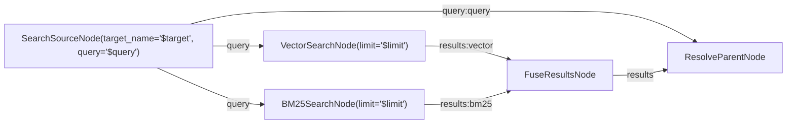

# rag3weaver

**Work in progress.** A Rust orchestrator where an agent's whole world lives in
one embedded database: the data, the words, the vectors, the code graph, the
processing graphs, the tools and the memories — all declared, all addressable,
all in one process.

It runs on [rag3db](../../README.md) (graph + HNSW, embedded) and on
[lucivy](https://github.com/L-Defraiteur/lucivy/) (BM25, in-process). Native only.

## The idea

*Everything lives in one system, and everything in it is declared.*

A knowledge base is a declaration (`EntityConfig`): its fields, its chunking,
its relations, its search signals. A processing step is a graph of typed nodes,
written as a Mermaid diagram. A tool for the agent is a node. A memory is a
template. One more declared thing, and the system knows how to ingest it, index
it, search it, and show what it did, node by node.

The aim, in one image: *you talk to your code or to your site, and it changes in
front of you* — no report to read, the screen shows what happens, and everything
is clickable. The long version (French):
[`visions/00-vision-generale.md`](visions/00-vision-generale.md).

## What exists today

| Layer | What it is | State |
|---|---|---|
| ingestion | records → chunks → rows → links → embeddings, by batches, resumable after a crash | delivered, measured on benches |
| hybrid search | BM25 (lucivy, 5 query modes) + dense HNSW + learned sparse, rank fusion, optional cross-encoder reranking | delivered |
| dataflow | a DAG runtime with typed ports, 47 built-in nodes, Mermaid templates, execution reports, checkpoints and undo | delivered |
| code graph | `codeparsers` (submodule, 13 languages): scopes, symbols, usages, impact, links between files; a synchronizer that re-indexes what changed | delivered; `usages`, `impact`, links |
| the agent's backend | `rag3weaver-backend` and `rag3weaver-chat`: search, read, grep, edit, run, sections after each tool; LLM through an OpenAI-compatible API or a local model | delivered, in daily use on this repository |
| embeddings | granite-embedding-278m by default (107m on a first large index or a weak GPU), MiniLM, multilingual MiniLM, BGE-M3 — all on burn/wgpu (Vulkan); an embedding service and a daemon (`rag3daemon`, `rag3weaver-embeddings`) | delivered |
| multi-tenant | `org` × `project` on every row, one FTS and sparse index per cell | delivered |
| other backends | `SchemaDialect` trait with a PostgreSQL implementation (`postgres` feature) | partial — the contract a dialect must honour is not written yet |
| long memory | a `memory` template, references, states | in progress |
| context cards, declared backend and views, talking to a page | | visions — nothing coded |

## Measured

First index of this repository (about 7 000 files, 80 000 scopes, 1.1 million
relations), on disk, with embeddings:

| | September 2026 | 8 October 2026 |
|---|---|---|
| duration | 753 s | **78 s** (median of three runs) |
| peak memory | | 9 Go |
| first searchable results | at the end | after 8–10 s |

The 78 s needs three settings that are **not yet the defaults**: full text stored
beside the database as files (instead of blobs inside it), one transaction per
batch, and batches of 2 048 files. The switch is prepared on a branch and waits
for a decision; today's defaults are 64 files per batch, no batch transaction,
full text in blobs. Numbers come from a held measurement on one machine (AMD
Radeon 8060S); they say "faster", not "fast everywhere".

## Quick start

```rust
let mut catalog = Catalog::new(conn, embedder, config);
catalog.initialize().await?;

catalog.register_entity("Product", EntityConfig {
    fields: vec![
        SimpleFieldDef::new("name", FieldType::String, FieldRole::Title),
        SimpleFieldDef::new("description", FieldType::Text, FieldRole::Content),
    ],
    signals: SearchSignals::BM25 | SearchSignals::VECTOR,
    ..Default::default()
}).await?;

catalog.ingest_entities("Product", vec![
    btree_map!{ "name" => "Rust Book", "description" => "A guide to Rust..." },
]).await?;

let response = catalog.search("Product", "rust ownership", SearchOptions::default()).await?;
for r in &response.results {
    println!("{} (score={:.4})", r.uuid, r.score);
}
```

A search is itself a graph. The same thing as a Mermaid template
(`templates/simple_hybrid_search.mmd`):


```mermaid
graph LR
    source["SearchSourceNode(target_name='$target', query='$query')"]
    vector["VectorSearchNode(limit='$limit')"]
    bm25["BM25SearchNode(limit='$limit')"]
    fuse["FuseResultsNode"]
    resolve["ResolveParentNode"]

    source -->|query| vector
    source -->|query| bm25
    source -->|query:query| resolve
    vector -->|results:vector| fuse
    bm25 -->|results:bm25| fuse
    fuse -->|results| resolve
```

```rust
let (output, report) = runtime.execute_with_report(&mut graph).await?;
// report.nodes: name, status, duration_ms, output ports, metrics
// report.edges: from, to, value summary
```

## Search

Three signals, combinable as bitflags (`BM25`, `VECTOR`, `SPARSE`), fused by
reciprocal rank (or weighted), with each signal either feeding candidates or
boosting them. BM25 has five query modes — `Contains` (substring across tokens,
fuzzy, relaxed separators), `ContainsSplit`, `Regex`, `Parse` (boolean syntax),
`Symbol` (exact, separators included: `foo->bar`, `std::sync::Arc<Mutex<T>>`).
Highlights are aligned to chunks. Engine warnings come back in
`SearchMeta.warnings` on every search.

When a signal is unavailable or fails, the search falls back on the others and
says so in its status (`signal is not available` / `signal failed`) — never a
silent empty result.

Full text is stored either **in the database as blobs** (today's default, nothing
to back up beside the database) or **as files in `<base>.fts/`** (lower memory,
faster reopen; opt-in for now).

## The code graph

With the `code` feature, a repository becomes a graph: files, scopes, symbols,
`DEFINES`, `CONSUMES`, `REFERENCES`, `MENTIONS` edges, with a `resolution` mark on each
edge saying how it was found (by path, by name, guessed). The synchronizer
indexes by batches, marks what it has proven, and on restart redoes only what is
incomplete. Tools built on it: `usages`, `impact` (what depends on this), links
rendered as a tree.

## Embeddings and rerankers

All production models run on burn (wgpu/Vulkan — AMD, NVIDIA, Apple with one
implementation); candle stays as the parity oracle (`candle-embedder`), checked
bit for bit, not by a rounded cosine.

| Model | Dims | Use |
|---|---|---|
| granite-embedding-278m-multilingual | 768 | default |
| granite-embedding-107m-multilingual | 384 | first index of a large repository, or a weak GPU |
| all-MiniLM-L6-v2, paraphrase-multilingual-MiniLM-L12-v2 | 384 | light |
| BGE-M3 | 1024 | dense + learned sparse in one forward pass (`DualEmbedder`) |

Rerankers (`RerankNode`, `set_reranker`): ms-marco MiniLM, mmarco multilingual
MiniLM, bge-reranker-v2-m3. OCR (`ocr`, `burn-ocr`): PP-OCR on burn. Weights are
not bundled; they are published as `burnpack` files with upstream attribution
(see `generated/README.md`).

Any provider plugs in through traits: `Embedder`, `SparseEmbedder`,
`DualEmbedder`, `Reranker` (and their `Callback*` helpers). The core has no ML
dependency.

## Features

No feature is on by default.

| Feature | What it adds |
|---|---|
| `rag3db-native` | the rag3db connection (links the shared library built from the fork) |
| `postgres` | the PostgreSQL dialect and blob store |
| `burn-embedder` | the burn models on Vulkan (`burn-rocm` for ROCm) |
| `candle-embedder`, `bge-m3`, `cuda` | the candle reference models |
| `code` | the code graph (`codeparsers`, sandboxed file access) |
| `daemon` | the embedding daemon and service client |
| `openai-llm` | an OpenAI-compatible LLM client |
| `ocr`, `burn-ocr` | OCR |

Runtime knobs are `RAG3WEAVER_*` environment variables (about sixty; the ones
that matter for ingestion are `RAG3WEAVER_EMBED_MODEL`, `RAG3WEAVER_EMBED_SERVICE`,
`RAG3WEAVER_GPU_DUTY`, `RAG3WEAVER_EMBED_CHAR_BUDGET`, `RAG3WEAVER_TX_PAR_PAQUET`,
`RAG3WEAVER_TX_PAQUETS_PAR_VALIDATION`). They are documented where they are read.

## Tests

```bash
cargo test --lib --features "rag3db-native"        # unit tests
./run_e2e.sh                                        # end-to-end suites (87 files under tests/)
./run_e2e.sh --test e2e_code                        # one suite
```

End-to-end tests link the rag3db shared library (see `BUILD.md` at the root).
Several suites embed on the GPU; the ones that measure durability kill the
process with the database open and replay the journal.

## Where things are

```
src/
├── catalog.rs, catalog/        register, ingest, search; the batch synchronizer
├── search*.rs, fts_*.rs        signals, fusion, lucivy handle, FTS storage modes
├── dataflow/                   graph, runtime, ports, 47 nodes, Mermaid, reports, checkpoints
├── code*.rs, backend*.rs       code graph, agent backend and its tools
├── burn_*.rs, candle_*.rs      models
├── dialect.rs                  SchemaDialect: rag3db, PostgreSQL
├── scope.rs                    org × project
└── bin/                        rag3weaver-backend, rag3weaver-chat, rag3daemon, rag3weaver-embeddings
templates/                      Mermaid pipelines
codeparsers/                    submodule
docs/                           design notes and session reports (French), dated folders
visions/                        where this is going (French)
```

## License

[Luciform Research Source License (LRSL) v1.2](LICENSE)
