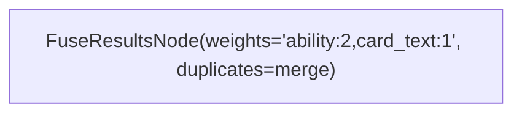

# Fusion et parcours composables — 19-09-2026

## Objectif et vocabulaire

Cas pratique demandé : rechercher les capacités qui parlent du cimetière, suivre leurs relations vers les cartes, recouper avec les cartes d'un deck ou de la collection, fusionner avec une recherche directe dans les cartes en favorisant la branche capacité. Un seul Mermaid doit exécuter le parcours.

Les [idées de verbes](04-inspi-chatgpt.txt) correspondent aux opérations suivantes :

| Verbe | Brique disponible |
| --- | --- |
| Search | `BM25SearchNode`, `VectorSearchNode`, etc. pour des candidats classés |
| Filter / Select | Nouveau `SelectRecordsNode` : sélection exhaustive par prédicat, sur une entité |
| Traverse | `FetchRelatedNode`, puis nouveau `RelatedResultsNode` pour remettre les voisins dans un flux de résultats scorés |
| Intersect | Nouveau `IntersectResultsNode`, clé `(entity, uuid)` ; conserve le score de la branche recherchée |
| Fuse | `FuseResultsNode`, poids par signal, RRF ou pondération des scores normalisés |
| Deduplicate | Politique intégrée à la fusion : `duplicates=merge` ou `keep` |
| Rerank | `RerankNode` existant : réévaluation des candidats, distincte de la fusion |
| Paginate | `PaginateNode`, après restriction et fusion |

Il ne s'agit pas de renommer les nœuds existants ni de créer des verbes spécifiques à Magic.

## Contrat de fusion



- `merge`, par défaut : un résultat par **type d'entité et identifiant stable**. Deux types différents portant le même identifiant ne sont pas fusionnés.
- `keep` : les occurrences sont conservées, chacune avec son signal et ses données/preuves d'origine. **Le score est celui de l'objet après fusion**, répété sur ses occurrences ; ce n'est pas son ancien score de branche. Ce mode sert notamment à inspecter les chemins.
- Une répétition du même objet dans une même branche n'ajoute pas artificiellement une contribution RRF supplémentaire. La première occurrence classée de cette branche contribue.
- Les preuves `matched_children` et `other_children` des différentes branches sont réunies en mode `merge`. Le champ `signal` indique les branches contributrices, sauf étiquette de sortie explicitement configurée.
- `top_k`, s'il est demandé, borne chaque branche avant fusion et collecte des preuves. Une occurrence écartée ne doit pas être annoncée comme contributrice.
- Les tris à score égal utilisent l'identité encodée pour rendre la pagination reproductible.
- Les poids ne sont pas des probabilités. Avec RRF, ils pondèrent les rangs. Les conventions historiques du moteur pour une seule branche active restent inchangées.

Les données principales d'un objet proviennent de la première occurrence ; cela ne résout pas un conflit entre deux snapshots différents. Ne pas mélanger silencieusement des versions incompatibles d'une même source.

## Un seul Mermaid exécutable

[search_related_scoped.mmd](../../templates/tools/search_related_scoped.mmd) réalise :

1. Filtrer les définitions de mécaniques et suivre leurs liens vers les capacités.
2. Rechercher aussi directement dans les textes des capacités, puis fusionner ces deux ensembles.
3. Suivre les capacités vers les cartes.
4. En parallèle, rechercher directement dans les textes des cartes.
5. Sélectionner les entrées de deck ou de collection et suivre leurs relations vers les cartes autorisées.
6. Intersecter les deux branches de cartes avec ce périmètre.
7. Fusionner avec poids capacité 2, texte 1, puis paginer.

Les relations sont orientées `Card → Ability → Mechanic` et `Entry → Card`. Les deux premières sont parcourues en sens inverse. `RelatedResultsNode` conserve les parents qui justifient chaque voisin et prend le meilleur score parent, sans récompenser automatiquement le nombre de chemins.

Ce template de contrôle emploie des **prédicats exhaustifs**, sans top-k intermédiaire et sans appel à un modèle d'embeddings. Les sélections par texte sont des `contains` explicites, sensibles à la casse selon le dialecte : ce ne sont ni une recherche sémantique ni un analyseur de règles Magic. Le parcours peut recevoir des résultats des nœuds de recherche existants, mais remplacer une sélection exhaustive par des candidats BM25/dense implique une borne de rappel à rendre explicite. Le test lucivy + dense réel existant reste exécuté séparément.

Exemple de filtre sur le texte anglais :

```json
{"field":{"key":"text","value":[{"op":"contains","value":"graveyard"}]}}
```

Même graphe, autre périmètre : filtre `deck_id` pour un deck, ou entrée de collection avec `quantity > 0`. L'intersection conserve aussi la preuve d'appartenance et sa quantité dans `other_children`, sans augmenter le score de pertinence.

Les noms d'entités, relations et filtres sont des paramètres du template. Les nouveaux nœuds sont aussi autorisés par l'hôte de backend déclaratif ; ils n'exposent pas de Cypher libre à l'appelant. `SelectRecordsNode` vise pour l'instant le stockage rag3db et une seule entité ; les relations se parcourent dans le DAG.

## Défauts trouvés sur la route

### Flashback avec coût absent du registre de liens

Le tableau des capacités était présent. L'erreur était dans le rattachement au glossaire : l'égalité du texte entier ne reconnaissait pas `Flashback {3}{W}` comme `Flashback`. Arena fournit pourtant `Abilities.BaseId=35`, et la capacité 35 porte le libellé `Flashback`.

Correction dans l'adaptateur expérimental Magic : résolution du BaseId vers un libellé entier non ambigu du glossaire, confirmé au début du texte imprimé et suivi d'un coût, nombre ou séparateur. Les formulations comme « Hexproof from … » ne sont pas transformées en défense talismanique générale. Les simples mentions à l'intérieur d'une phrase restent des mentions.

Le nouveau lien est distingué par `relation=native_base_ability`. Le contrat passe en version `1.1.0`. Les identifiants natifs et le texte avec son coût sont conservés. Le glossaire n'est pas fusionné par sous-chaînes.

Contrôle du snapshot : 154 impressions liées à Flashback ; 13 entrées principales possédées avec identité couleur incluse dans noir/vert. Ce nombre n'est pas une validation de légalité en Historique. Les 12 tests de l'API passent, notamment Flash ≠ Flashback et les capacités conditionnelles.

L'API a été redémarrée et les quatre exports typés ainsi que `schema.json` ont été régénérés avec le snapshot `e44fdd1e50b8916e9d7e`. L'adaptateur reste dans le dossier ignoré `experiments/mtga/`.

### Fusion exécutée avant l'arrivée de la branche longue

Le contrôle indépendant attendait 17 cartes mais le Mermaid n'en rendait que 16. **Rite de l'oubli**, dont le texte imprimé ne dit pas « graveyard », manquait : son accès devait passer par la définition de Flashback. La relation était bien présente dans rag3db.

La trace a montré que `FuseResultsNode` s'exécutait avant la fin de la branche des mécaniques. Le runtime considérait un port fan-in prêt dès qu'un de ses producteurs avait émis.

Correction : attendre **la fin de tous les producteurs connectés**, en exécution ordinaire comme avec checkpoints. Un producteur terminé peut ne rien émettre sur une sortie optionnelle, notamment les métadonnées d'un signal de recherche désactivé. Attendre obligatoirement une valeur de chaque producteur bloquait sinon `RenderResultsNode` ; ce cas est couvert également.

Un test de non-régression vérifie branches de longueurs différentes, branche vide et sortie optionnelle absente, avec et sans checkpoints.

### Cache mémoire du test

Le corpus relationnel plus large a saturé les 256 Mio réservés au petit test initial. Le script alloue maintenant 1 Gio de buffer pool et 4 Gio de taille maximale pour la base jetable. Il ne change pas ces réglages sur la base de production.

## Validation et limites

[structured_payloads.rs](../../tests/structured_payloads.rs) charge les 49 impressions distinctes des 100 cartes de `mycotyrant_insidious TRIM (2)`, leurs capacités, leurs définitions liées et une carte témoin hors deck (`Dryad's Revival`). Le test compare l'ensemble rendu par le graphe à un calcul indépendant sur le snapshot.

Le test vérifie les modes merge/keep, le chemin de preuve Flashback, une page finale, un deck absent, et le changement de périmètre vers les entrées de collection du corpus de test. Il ne prétend pas avoir ingéré toute la collection dans le nouveau backend persistant.

Résultat du parcours deck : **17 cartes fusionnées**, **33 occurrences en mode keep**, sur 49 impressions distinctes. La différence 33/17 reflète les branches contributrices ; ce ne sont pas des quantités possédées.

Validation finale : **977 tests unitaires**, **3 tests d’intégration** (graphe Magic, lucivy + dense BGE-M3 réel, payloads imbriqués), **12 tests de l’API Magic**, et le test de persistance + MCP après redémarrage passent. Le périmètre collection rend 18 correspondances dans le corpus réduit, dont la carte témoin hors deck. `git diff --check` passe.

Un rapport structuré est produit dans `experiments/mtga/data/composed-search-report.json` (ignoré par Git). Les nœuds et le template sont dans le framework ; le modèle Magic complet et sa synchronisation de production restent à intégrer.

## Identifiants Arena et index

- API source SQLite : `cards.arena_id` est une clé primaire indexée.
- rag3weaver/rag3db : la clé primaire générée est `_uuid`. Un champ métier `arena_id` ne reçoit pas automatiquement d'index secondaire.
- `hashsafe` détermine une identité stable ; si ses valeurs sont connues, le client peut calculer l'UUID puis utiliser la recherche par clé primaire. Cela ne réécrit pas automatiquement un filtre Cypher sur `arena_id`.
- Les traversées de ce graphe utilisent les relations natives entre entités, pas une succession de recherches par identifiant Arena.

La déclaration d'index métier ou d'alias d'identité doit être un contrat explicite futur, pas une promesse déduite du nom d'un champ.
