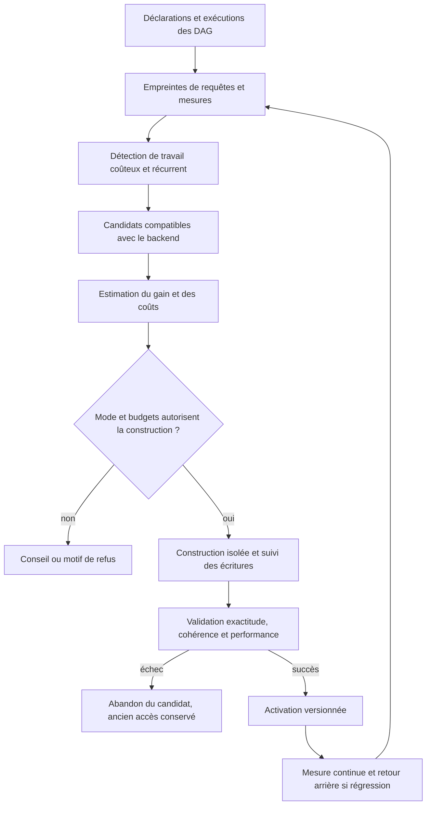

# Design à challenger : accès déclaratifs et optimisation adaptative

Date : **19-09-2026**. Projet : **rag3weaver**, avec **rag3db** comme stockage et **lucivy** comme moteur texte.

**Statut : proposition, non implémentée.** Les JSON, variables d'environnement, commandes et structures ci-dessous constituent un contrat à discuter ; ils ne sont pas acceptés actuellement par le manifeste. Aucun index ni paramètre de production n'est modifié par ce document.

## 1. Proposition en une phrase

Déclarer les identités et les usages importants, observer les requêtes réelles, puis laisser un contrôleur améliorer les accès **parmi les capacités réellement disponibles**, avec un budget, une validation mesurée et un retour arrière.

L'objectif n'est pas de créer tous les index possibles, ni de promettre qu'un schéma suffit à rendre une application prête pour la production. Il est de produire une décision explicable : « cette recherche fréquente parcourt trop de lignes ; tel accès devrait réduire ce travail ; voici son coût, sa validation et son état ».

Le contrôleur est générique. Les champs `arena_id`, les decks et les capacités Magic servent de cas de validation, pas de règles intégrées au framework.

## 2. Ce qui existe et ce qui reste à établir

| Élément | Constat local | Conséquence pour le design |
| --- | --- | --- |
| Identité des entités | rag3weaver génère une clé primaire `_uuid` ; `hashsafe` participe au calcul des identités | Une clé métier déclarée peut permettre de calculer un UUID, mais ce n'est pas encore une réécriture automatique de filtre |
| Recherche par clé primaire | L'optimiseur rag3db reconnaît une égalité sur la clé primaire et produit un `PRIMARY_KEY_SCAN` | Réutiliser cet accès avant de proposer un index supplémentaire |
| Élimination de blocs | Le moteur possède des prédicats de colonnes et des zone maps | Mesurer leur efficacité ; des dates dispersées peuvent rendre leurs bornes peu discriminantes |
| Index spécialisés | Infrastructure d'index et accès vectoriels ; schéma lucivy avec champs de filtre typés | Chaque adaptateur doit annoncer précisément ses opérations, sa cohérence et ses limites |
| Index secondaire ordonné/composite général | Support complet et maintenance non établis dans cette investigation | Ne pas générer un `CREATE INDEX (a,b)` imaginaire ; annoncer « non pris en charge » si nécessaire |
| Graphes de recherche | Nœuds de sélection, parcours, intersection, fusion et pagination | Le DAG apporte des usages observables et des possibilités d'optimisation avant même d'ajouter des index |
| Ajustement automatique selon la charge | Aucun contrôleur de ce type ajouté dans cette session | À construire par étapes |

Références locales : [schéma généré](../../src/schema.rs), [reconnaissance des clés et zone maps](../../../../src/optimizer/filter_push_down_optimizer.cpp), [interface d'index du moteur](../../../../src/include/storage/index/index.h), [champs de filtre lucivy](../../src/fts_handle.rs).

L'existence de `IndexInfo.columnIDs` ne prouve pas, à elle seule, la disponibilité d'un index composite exploitable, transactionnel et durable.

## 3. Séparer trois contrats

### 3.1 Contrat des données

Le schéma décrit types, nullabilité, identité et contraintes métier. `primary key` n'est pas un type : un entier peut être une quantité, une date ou une identité.

Une identité métier peut être composite, par exemple `(source_id, arena_id)`. La proposition conserve `_uuid` comme clé physique dans rag3weaver ; la déclaration métier fournit une résolution déterministe vers cette clé. Cette résolution demande un encodage canonique, un namespace et une version stables, ainsi que tous les composants de l'identité. Une égalité sur un seul composant ne suffit pas.

Déclarer une identité implique une validation, pas seulement un index. Le contrôleur ne déduit jamais l'unicité d'un échantillon et ne transforme pas automatiquement un champ en clé primaire. Une identité mutable ou une évolution de normalisation demande une migration explicite.

### 3.2 Contrat des usages : `access_patterns`

On déclare la forme des recherches importantes, sans imposer une structure physique.

Exemple **proposé** pour des événements :

```json
{
  "entity": "Event",
  "identity": {
    "fields": ["source_id", "event_id"],
    "immutable": true
  },
  "access_patterns": [
    {
      "name": "by_identity",
      "equals": ["source_id", "event_id"],
      "expect": "zero_or_one"
    },
    {
      "name": "by_deck_and_date",
      "equals": ["source_id", "deck_id"],
      "range": "created_at",
      "order_by": [
        {"field": "created_at", "direction": "asc"},
        {"field": "_uuid", "direction": "asc"}
      ],
      "pagination": "cursor",
      "target_p95_ms": 100
    }
  ]
}
```

`target_p95_ms` est un objectif à mesurer sur un matériel et une charge déclarés, **pas une garantie attachée au JSON**. Le schéma de `created_at` doit préciser son type et sa représentation, par exemple entier en millisecondes UTC ; le nom du champ ne permet pas de l'inférer.

Les patterns peuvent venir de deux sources complémentaires :

- **Déclaration** : utile au démarrage, pour les recherches critiques mais rares et pour les contrats stables du produit.
- **Observation des DAG et filtres instanciés** : révèle les usages réels et les combinaisons non anticipées.

Une même intention peut produire plusieurs accès selon la sélectivité. Le pattern n'est pas un plan d'exécution figé.

### 3.3 Contrat physique : capacités du backend

L'adaptateur annonce les accès qu'il sait construire, utiliser, maintenir et supprimer : égalité, intervalle, ordre, combinaisons de colonnes, listes, valeurs nulles, collation, cohérence, persistance et comportement pendant les écritures.

La réponse à un pattern est structurée :

```json
{
  "pattern": "by_deck_and_date",
  "status": "unsupported",
  "requested": ["equality_prefix", "ordered_range"],
  "available_plan": "scan_with_predicate_pushdown",
  "reason": "No verified composite ordered index adapter",
  "next_action": "measure_baseline"
}
```

Les états doivent distinguer accès non supporté, estimation inconnue, budget dépassé, construction en cours, accès prêt et accès invalide. Un mode automatique ne transforme pas un accès non supporté en accès supporté.

## 4. Le cas « 3 millions d'objets, un ID et du 15 au 24 août »

**Cas A : l'ID est unique.** Résoudre l'identité, lire zéro ou une ligne par clé primaire, puis vérifier la date. Un index composite supplémentaire a généralement peu d'intérêt.

**Cas B : l'ID désigne un deck/client possédant de nombreux événements.** Un accès ordonné avec préfixe d'égalité `(source_id, deck_id, created_at, _uuid)` est un candidat naturel si le moteur le prend en charge. Une autre possibilité est l'intersection d'accès séparés, ou le parcours des événements liés au deck puis le filtre temporel. Le choix dépend notamment de la taille du sous-ensemble.

**Cas C : la période couvre presque toute la table.** Un scan de colonnes avec élimination de blocs peut être préférable à un accès indirect suivi de millions de lectures dispersées.

Pour une période civile inclusive « du 15 au 24 août », produire un intervalle semi-ouvert : début du 15 inclus, début du 25 exclu, **dans le fuseau explicitement choisi**, puis conversion dans la représentation de stockage. Ni « fin du 24 à 23:59:59 » ni fuseau déduit silencieusement.

Le curseur de pagination doit porter l'ordre total, par exemple `(created_at, _uuid)`, ainsi que le contexte/version nécessaires. Un index ne résout pas à lui seul les doublons ou omissions causés par des écritures concurrentes entre deux pages ; le contrat de lecture doit préciser snapshot ou pagination sur données vivantes.

## 5. Pilotage par variable d'environnement

Proposition :

```bash
RAG3WEAVER_AUTO_INDEX=observe
# off | observe | advise | managed
```

| Mode | Action |
| --- | --- |
| `off` | Pas d'observation adaptative ni de nouvelle action automatique ; les index existants continuent à servir |
| `observe` | Collecte locale, bornée et échantillonnée ; aucune modification physique |
| `advise` | Observation + candidats argumentés ; aucune construction automatique |
| `managed` | Construction et activation des seuls accès autorisés par la politique, après vérification des budgets et de la capacité du backend |

**Proposition initiale : défaut `off`**, activation de `observe` lors d'un essai puis `advise` ; `managed` reste explicite. À challenger : faut-il `observe` par défaut si son coût et sa conservation sont strictement bornés ?

Un booléen unique serait trop ambigu : autorise-t-il l'observation, la construction, la suppression, les reconstructions bloquantes ? Le mode ne remplace donc pas la politique :

```json
{
  "optimization": {
    "mode": "advise",
    "policy": {
      "allowed_actions": ["build_index", "activate_index"],
      "allow_drop_managed_indexes": false,
      "allow_blocking_build": false,
      "max_managed_index_bytes": 536870912,
      "max_build_memory_bytes": 268435456,
      "max_concurrent_builds": 1,
      "min_observations": 200,
      "observation_window_minutes": 60,
      "cooldown_minutes": 120,
      "target_patterns": ["by_deck_and_date"]
    }
  }
}
```

Valeurs illustratives, à calibrer. Le budget de construction distingue mémoire et espace disque temporaire ; le budget total distingue index actifs et anciennes générations conservées pour retour arrière.

**Priorité proposée** : contraintes administrateur/backend non contournables, politique du manifeste, puis variable d'environnement pour sélectionner le mode demandé. L'environnement peut activer `managed` uniquement dans le périmètre autorisé par la politique ; il ne lève pas ses budgets ni l'interdiction des constructions bloquantes. Sans politique explicite, `managed` est refusé avec une explication.

Passer à `off` suspend les nouvelles décisions et les travaux en attente. Cela ne détruit pas les index. Une construction déjà engagée s'arrête seulement à un point d'annulation que le backend sait rendre sûr ; son état reste visible.

## 6. Boucle adaptative proposée



### Observer les usages sans stocker toutes les requêtes

Une empreinte inclut : version du schéma, entités, opérateurs, chemins imbriqués, relations parcourues, ordre, projection, mode exact/approximatif, version du DAG et frontières de portée. Les valeurs littérales sont remplacées par des paramètres ; des classes de sélectivité distinguent toutefois « un deck minuscule » et « un deck très volumineux ».

Mesures utiles : fréquence, p50/p95/p99, lignes/blocs examinés si disponibles, candidats avant/après chaque restriction, résultats rendus, temps CPU/IO, mémoire et coût des écritures. Pour un DAG parallèle, additionner les durées de tous les nœuds surestime la latence : mesurer également le chemin critique et les attentes.

La télémétrie ne conserve par défaut ni texte libre des recherches ni valeurs brutes d'identifiants. Échantillonnage, durée de conservation et nombre d'empreintes sont bornés. Un cache chaud et une série de requêtes identiques ne constituent pas, seuls, un benchmark représentatif.

### Détecter une mauvaise optimisation

« Souvent exécutée » n'est pas suffisant. Prioriser fréquence × coût évitable, avec objectifs explicites pour les requêtes critiques rares. Un taux élevé de lignes examinées par résultat est un signal, pas une preuve : certaines requêtes doivent réellement lire beaucoup de données.

Distinguer coût d'accès, génération d'embeddings, reranking, attente d'une écriture et mauvaise topologie du DAG. Un index ne corrige pas une fusion lancée trop tôt ou une pagination placée avant une intersection.

### Choisir un petit nombre de candidats

Ne pas indexer toutes les combinaisons : leur nombre et leur coût deviennent rapidement ingérables. Partir des patterns et charges réellement observés, des index déjà présents et des chemins relationnels existants.

Candidats possibles, **si supportés** : résolution de clé métier vers `_uuid`, index d'égalité, index ordonné, index composite, filtres typés dans un index de recherche, ou réécriture sûre du plan pour réduire les candidats plus tôt. Déplacement physique/partitionnement, vues matérialisées et réindexation dense sont des actions distinctes, exclues du premier contrôleur.

Une règle « égalités avant intervalle » fournit un candidat, pas une vérité universelle. Plusieurs champs d'égalité, des distributions déséquilibrées ou un ordre demandé peuvent changer le meilleur choix. Sans estimation fiable, mesurer plutôt que prétendre connaître un coût précis.

Le score de décision doit exposer ses composants : gain de lecture attendu, coût de construction, espace, mémoire et surcoût d'écriture. La période d'amortissement doit être inférieure à la durée de vie probable du pattern. Prévoir hystérésis et délai minimal avant réexamen pour éviter les créations/suppressions oscillantes.

## 7. Exactitude et cycle de vie : prérequis à `managed`

Une optimisation physique ne change pas le sens d'une recherche exacte. Elle doit préserver notamment :

- portée source/tenant, types, nulls, timezone et collation ;
- mêmes éléments pour un filtre sur tableau de structures : `abilities[].name = X AND abilities[].level >= 3` ne doit pas matcher deux éléments distincts ;
- identité, déduplication, ordre total et pagination ;
- sémantique des scores et des preuves : pousser une restriction avant une fusion n'est pas toujours neutre pour les rangs RRF ou la normalisation des scores ;
- mises à jour et suppressions, pas seulement les insertions initiales.

Le mode exact/approximatif fait partie du contrat. Un accès ANN dense se valide aussi par son rappel ; il ne remplace pas silencieusement une sélection exhaustive. Une modification de paramètres ANN n'est pas une simple création d'index secondaire.

Pour une construction avec écritures concurrentes, le backend doit fournir un protocole vérifiable : snapshot/watermark, rattrapage des changements, contrôle de retard, puis bascule cohérente. Si ce protocole n'existe pas, le contrôleur ne prétend pas construire en ligne : il reste en conseil ou requiert une fenêtre de maintenance déclarée.

Un index externe en retard peut produire des **faux négatifs**. Relire les candidats trouvés dans rag3db ne récupère pas les objets manquants. Il faut donc une cohérence suffisante, l'union avec les changements non indexés, ou un repli correct ; sinon renvoyer une indisponibilité explicite selon le contrat. Ne pas filtrer simplement une petite page ANN après coup et déclarer le résultat exhaustif.

États proposés : `proposed → building → validating → active → retiring → removed`, avec `failed` et `invalid`. Un journal persistant conserve propriétaire, entité, champs, version du schéma, capacités requises, empreinte de définition, avancement, mesures et motif d'activation/retrait.

Une seule autorité de gestion par base doit construire un même candidat : verrou/lease et idempotence. Les autres hôtes observent l'état. Après crash, reprise ou abandon explicite des générations incomplètes ; pas d'activation sur la simple existence d'un fichier.

Les index manuels et les structures assurant une contrainte d'intégrité ne sont jamais supprimés par ce contrôleur. La collecte d'anciens index gérés nécessite une politique explicite et l'absence de lecteurs encore attachés à leur génération. Sans primitive de bascule sûre, `managed` n'est pas éligible pour cet accès.

## 8. Expliquer les décisions

Prévoir des opérations structurées accessibles depuis le backend et son MCP :

- `explain_access` : pattern, plan disponible, accès retenu, estimations et limites ;
- `list_index_recommendations` : candidats avec preuves et coût estimé ;
- `list_managed_indexes` : état, génération, propriétaire, fraîcheur et usage ;
- `evaluate_access_pattern` : résultat d'un benchmark reproductible ;
- commandes de construction/retrait uniquement si la politique les expose.

Ce sont des noms proposés, pas des outils existants. La décision est déterministe, journalisée et testable ; elle ne dépend pas d'un LLM qui improvise du DDL. Un agent peut expliquer ou challenger les recommandations.

## 9. Répartition des responsabilités

| Couche | Responsabilité |
| --- | --- |
| Template JSON / JSON Schema | Identité, types, contraintes, patterns importants et politique |
| Mermaid / runtime | Composition, emplacement sémantiquement correct des restrictions, métriques et provenance |
| Contrôleur rag3weaver | Agrégation de charge, candidats, budgets, décisions, suivi et explications |
| Adaptateur rag3db/lucivy | Capacités déclarées, compilation des accès, protocole de maintenance et de cohérence |
| Moteur C++ rag3db | Structures physiques natives, transactions, statistiques et sélection des accès dans son optimiseur |
| Application Magic | Schéma de domaine et cas de validation ; aucun réglage caché propre aux cartes |

Le contrôleur n'est pas un second optimiseur Cypher complet. Il choisit et entretient les moyens d'accès ; le moteur choisit leur emploi pour une exécution. Une réécriture de DAG exige ses propres règles de préservation des résultats et du classement.

## 10. Plan de validation avant une promesse de production

### Étape 1 — Contrat et observation

Valider des patterns sans mutation physique. Inventorier les capacités natives. Ajouter explication et instrumentation échantillonnée. Déterminer si les métriques nécessaires sont disponibles ou si le moteur doit les exposer.

### Étape 2 — Trois millions de lignes et conseils

Corpus reproductible avec identités uniques, clés de regroupement très déséquilibrées, dates ordonnées puis dispersées, nulls et insertions/mises à jour/suppressions. Comparer : ID unique + date, ID non unique + date, date seule, intervalles étroits/larges, zéro résultat, limites de période et pagination.

Mesurer à froid et à chaud, après redémarrage, sous lectures et écritures concurrentes. Rapporter exactitude, p95, débit d'ingestion, mémoire, disque et durée de construction. Les objectifs sont des paramètres de campagne, pas des chiffres inventés à l'avance.

### Étape 3 — Un seul accès géré

Choisir un type d'accès réellement supporté. Tester construction interrompue, reprise, retard, disque/budget insuffisant, activation, retour arrière, double démarrage du contrôleur et absence d'oscillation. Garder le plan précédent utilisable pendant la validation lorsque le backend le permet.

### Étape 4 — Extension contrôlée

Ajouter d'autres accès seulement après preuve d'utilité. Des index secondaires ordonnés/composites peuvent nécessiter une évolution du moteur C++ ; le contrat des patterns doit rester valide même quand leur réalisation physique n'est pas encore disponible.

## 11. Questions à challenger

1. Le découpage identité / usage / accès physique est-il suffisant ? Quelles contraintes manque-t-il ?
2. Faut-il `off` ou `observe` par défaut ? Quels coûts et quelle conservation sont acceptables ?
3. L'environnement choisit-il seulement le mode, ou doit-il aussi pouvoir sélectionner un profil de budgets ?
4. Le premier gain doit-il être la résolution des identités métier vers `_uuid`, les filtres lucivy, ou un index secondaire natif ? Quelles mesures trancheraient ?
5. Quels patterns peuvent être extraits sûrement d'un DAG sans figer sa stratégie de recherche ni changer le classement ?
6. Quelles statistiques minimales faut-il exposer dans rag3db pour éviter un conseiller fondé sur des suppositions ?
7. Quel protocole de cohérence permet une construction en ligne ? Que faire quand le backend ne le possède pas ?
8. Comment éviter qu'une charge temporaire ou un seul gros tenant monopolise le budget d'index ?
9. Quelles garanties de lecture et de pagination le produit veut-il pendant les écritures ?
10. Quels critères mesurés autorisent l'activation et imposent le retour arrière ? Qui porte ces objectifs ?
11. Les index de tableaux imbriqués doivent-ils conserver une identité d'élément ou imposer une normalisation en entités liées ?
12. Où arrêter l'automatisation pour ne pas réimplémenter l'optimiseur du moteur dans rag3weaver ?

**Décision proposée à ce stade :** adopter le contrat `access_patterns` et construire d'abord `observe/advise` avec un benchmark de 3 millions de lignes. Garder `managed` dans le design, mais conditionner son activation à la preuve du cycle de vie et de la cohérence d'au moins un type d'accès concret.
