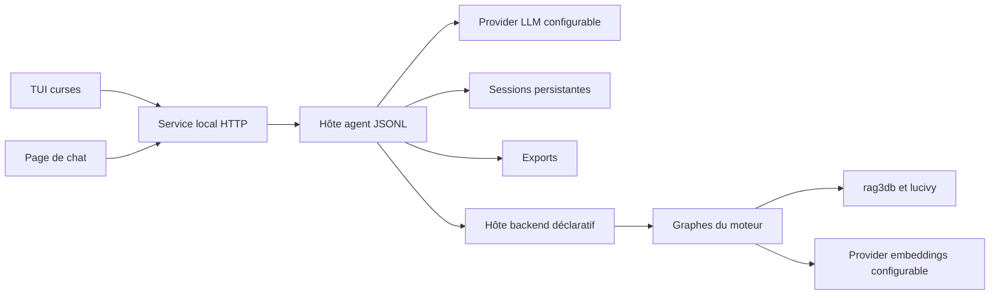

# Agent générique : TUI, chat web et providers configurables

Date : 20-09-2026. Première implémentation locale. Le thème Magic appartient au manifeste et au prompt de l'application ; aucun outil de code, vocabulaire de carte ou collecteur MTGA n'est imposé par la boucle d'agent.

## Ce qui fonctionne

Un lancement sert une page de chat locale **et** ouvre un TUI. Les deux passent par le même processus `rag3weaver-chat`, qui réutilise `Agent` et `ToolBox`. Un tour comprend plusieurs générations et appels d'outils, avec les limites déjà présentes dans le moteur. Les sessions conservent les messages, appels, identifiants et résultats des outils après redémarrage.

Le web affiche le texte progressivement, les appels d'outils dépliables, les conversations sauvegardées et les exports téléchargeables. Le TUI affiche texte et outils, défile avec Page↑/Page↓, crée une conversation avec F2, liste les exports avec F3 et peut reprendre une session par `--session ID`. Les deux demandent l'annulation du même agent. Un seul tour est exécuté à la fois ; un autre reçoit une erreur « occupé », sans mélanger ses réponses.



La boucle et les services génériques vivent dans [`src/chat.rs`](../../src/chat.rs). Le [binaire agent](../../src/bin/rag3weaver-chat.rs) adapte les outils du backend JSONL. Le [service HTTP et TUI](../../scripts/chat_app.py) utilise la bibliothèque standard Python ; la [page](../../ui/chat/index.html) ne nécessite ni CDN ni bibliothèque JS. Ce sont des clients du moteur, pas une seconde boucle d'agent en Python ou dans le MCP.

## Essai immédiat des deux interfaces

Depuis la racine de rag3db :

```bash
cargo build --offline --manifest-path extension/rag3weaver/Cargo.toml \
  --features openai-llm --bin rag3weaver-chat -j 2

python3 extension/rag3weaver/scripts/chat_app.py \
  extension/rag3weaver/templates/apps/notebook/chat.json --demo
```

Le terminal affiche un lien `http://127.0.0.1:8740/#token=…`. L'ouvrir pour utiliser le web pendant que le TUI reste actif. `Ctrl-Q` ferme l'application proprement ; `Échap` demande l'annulation du tour. Avec `--web-only`, le serveur reste au premier plan et se ferme par `Ctrl-C`. `--port` change le port.

**Le mode démo est explicitement factice** : réponse fixe, aucune recherche, aucun appel au provider et aucun démarrage du backend, même s'il est déclaré dans la configuration. Il sert à essayer les interfaces, pas à valider un deck. Il sauvegarde ses conversations ; choisir un nouveau dossier de données pour l'usage réel.

Pour attacher un autre TUI au service existant :

```bash
# Variable contenant le jeton de cette instance, pas une clé de provider.
RAG3WEAVER_CHAT_TOKEN='<jeton du lien local>' \
python3 extension/rag3weaver/scripts/chat_app.py \
  --attach http://127.0.0.1:8740 --session '<identifiant de conversation>'
```

Les interfaces peuvent reprendre une même session ; elles ne synchronisent pas encore en direct le texte affiché dans plusieurs fenêtres. Recharger l'historique après un tour effectué depuis l'autre interface.

## Choisir le modèle de chat

Copier puis adapter [`templates/apps/notebook/chat.json`](../../templates/apps/notebook/chat.json). Retirer `--demo` pour utiliser le vrai modèle. Le premier adapter utilise le contrat HTTP compatible `/chat/completions` déjà disponible dans `OpenAiLlm` : il convient à un serveur llama.cpp correctement configuré pour les appels d'outils ou à un provider compatible distant.

```json
{
  "name": "Mon atelier",
  "system_prompt": "Aide à explorer les données avec les outils exposés. N'invente pas de résultat de recherche. Enregistre les exports demandés avec save_artifact.",
  "llm": {
    "base_url": "http://127.0.0.1:8080/v1",
    "model": "nom-du-modele-servi",
    "context_tokens": 32768,
    "api_key_env": "MY_CHAT_API_KEY"
  },
  "backend_command": [],
  "state_dir": "data",
  "max_iterations": 12,
  "max_output_tokens": 4096,
  "temperature": 0.7,
  "top_p": 0.95,
  "max_tool_output_bytes": 32768
}
```

Omettre `api_key_env` si le serveur local n'exige pas de clé. Si déclaré, son absence est une erreur de démarrage. Les clés viennent de l'environnement du processus ; elles ne sont pas transmises au navigateur ni enregistrées dans les sessions. Le fournisseur LLM reçoit les messages et les résultats des outils nécessaires à ses tours. Le nom du modèle et le contexte doivent correspondre à son serveur, pas à un modèle téléchargé implicitement par l'application.

`state_dir` est résolu relativement au fichier de configuration. Il contient `sessions/` et `artifacts/`. Les écritures de session passent par un fichier temporaire synchronisé puis renommé. `save_artifact` écrit uniquement un nom simple dans `artifacts/`, limite le contenu à 2 Mio et refuse l'écrasement d'un fichier existant. Le modèle doit demander un autre nom pour une nouvelle version.

## Brancher un backend métier

`backend_command` est un tableau d'arguments exécuté directement, **sans shell**. Par exemple, depuis la racine du dépôt :

```json
{
  "backend_command": [
    "extension/rag3weaver/target/debug/rag3weaver-backend",
    "extension/rag3weaver/templates/backends/notebook/backend.json"
  ],
  "allowed_tools": ["get_note", "put_note"]
}
```

Ce fragment complète la configuration de chat. Les chemins de commande sont relatifs au répertoire de lancement ; utiliser des chemins absolus pour un lanceur indépendant de ce répertoire. Le backend doit être compilé avec ses bibliothèques natives et son service d'embeddings prêt : voir le [carnet déclaratif](../../templates/backends/notebook/README.md).

Le host lit `describe`, transforme les contrats `inputSchema` en définitions d'outils et transmet les appels à `call`. `allowed_tools` absent expose les outils du manifeste ; `[]` n'expose aucun outil du backend. Un nom inconnu ou désactivé est refusé à l'exécution, même si le modèle tente de l'appeler. Une faute dans la liste provoque une erreur de démarrage. `save_artifact` reste l'outil générique de l'application.

Pour Magic, le même mécanisme peut viser `experiments/mtga/backend/backend.json` avec un prompt métier. **Ce tour n'a pas ouvert ni validé à nouveau cette base** : le défaut d'intégrité des capacités persistées décrit au [rapport 13](13-revision-des-13-decks-et-audit-des-donnees.md) reste à traiter. Ne pas présenter le test des interfaces comme une validation des données Magic.

Lorsqu'une recherche fournit `presentation`, le modèle reçoit ce rendu avec ses métadonnées, sans recevoir une deuxième fois toute la liste JSON brute. Le rendu reste défini par le backend et ses templates. Sans rendu, le résultat JSON reste disponible. La vue textuelle transmise au modèle est bornée par `max_tool_output_bytes` (32 Kio par défaut) : elle conserve le début, coupe entre lignes si possible et indique `... N more lines (output truncated)`. Pour une ligne unique trop longue, la coupure respecte UTF-8 et indique les octets omis. Cette borne ne change ni la requête, ni son exhaustivité dans le moteur ; un export direct vers fichier peut traiter tout le résultat. Ce mécanisme ne produit pas automatiquement un fichier de résultat complet. Les détails des outils sont consultables dans les interfaces et conservés dans l'historique.

Le MCP existant reste une autre porte d'entrée vers les outils déclarés. **Ne pas démarrer simultanément deux hôtes propriétaires de la même base** pour le chat et le MCP. Un endpoint MCP relayant le processus déjà ouvert reste à ajouter si l'on veut les deux accès concurrents ; cette première interface ne l'implémente pas.

## Choisir les embeddings séparément

Dans le manifeste **backend**, les configurations existantes restent valides : `provider` omis signifie `daemon`. Le GPU local déjà préparé peut donc rester utilisé pour les vecteurs, quel que soit le LLM du chat.

Un endpoint compatible `/embeddings` peut désormais être déclaré :

```json
{
  "embeddings": {
    "provider": "compatible",
    "address": "https://mon-provider.example/v1",
    "model": "mon-modele-embedding",
    "dimensions": 1024,
    "api_key_env": "MY_EMBEDDING_API_KEY"
  }
}
```

[`HttpEmbedder`](../../src/http_embedder.rs) implémente le trait existant, sans dépendre de Magic, du TUI ou du MCP. Il envoie un lot de textes, réordonne les réponses selon `index` et refuse les comptes incorrects, indices dupliqués, dimensions incorrectes ou composantes non finies. Délai HTTP global : 120 s ; corps limité à 64 Mio ; les erreurs HTTP sont rendues explicitement. Cet adapter n'ajoute pas encore de politique de réessai.

Avec un provider externe, les textes ingérés et les requêtes d'embedding quittent la machine. Changer le modèle, ses dimensions **ou son espace vectoriel réel** exige un nouvel index / une réingestion. Un même alias et une même dimension ne prouvent pas que deux providers produisent des vecteurs compatibles. L'identité complète de cet espace et sa migration automatique restent à formaliser.

## Validation et limites

Validation locale sans provider payant ni base Magic :

- Compilation du host agent ; vérification de compilation du host backend avec le nouvel adapter d'embeddings.
- **1 099 tests Rust réussis** avec `daemon,openai-llm`, incluant sauvegarde/reprise, annulation avant effet de bord, confinement des exports et contrat HTTP des embeddings.
- **4 tests de parcours réussis**. [`test_chat_app.py`](../../scripts/test_chat_app.py) fait tourner le véritable agent Rust contre un fournisseur SSE local et un backend de test : refus d'un outil désactivé, recherche, utilisation du résultat rendu, export effectif et reprise après redémarrage.
- Annulation limitée à la conversation active ; une requête concurrente reçoit 409 et ne désynchronise pas le protocole.
- TUI essayé dans un pseudo-terminal, saisie/réponse et fermeture propre. Page essayée dans Chromium : streaming, outils et rechargement de l'historique. Ce test navigateur est optionnel si Chromium/chromedriver ne sont pas installés.
- Accès web par jeton d'instance, vérification Host/Origin, écoute limitée à `127.0.0.1`, affichage via `textContent`, refus de parcours de chemins et d'origines étrangères.

Commandes de validation :

```bash
TMPDIR=/var/tmp cargo test --offline --manifest-path extension/rag3weaver/Cargo.toml \
  --features daemon,openai-llm --lib -j 2
python3 extension/rag3weaver/scripts/test_chat_app.py
```

Limites assumées de cette première version :

- Annulation coopérative : elle peut attendre le prochain token, point de réessai ou retour d'un outil. Un appel HTTP ou backend muet peut retarder l'arrêt ; l'UI ne tue pas brutalement un processus propriétaire de la base.
- Conversations complètes, sans compression automatique ni mémoire longue branchée à `Session`. Les budgets d'itérations/sortie bornent un tour, pas un historique entier. Le dépassement de contexte reste une erreur à traiter côté produit.
- Un seul hôte par application/dossier de sessions ; pas de gestion multi-utilisateur, verrou distribué, migration de sessions ou authentification réseau publique.
- Pas encore d'import par glisser-déposer, d'assistant d'installation MTGA Tool, d'accès mémoire au jeu ou d'automatisation de son interface. L'agent peut guider l'utilisateur et exécuter les outils explicitement fournis par son backend.
- La page reste un chat textuel : pas de pièces jointes multimodales ou de rendu riche spécialisé Magic. Le TUI fournit une saisie simple, pas un éditeur multiligne complet.
- Pas de paquet npm, binaire livré multi-plateforme ou mise à jour signée dans ce changement.

## Responsabilités à garder dans la suite

Le produit choisit son prompt, ses outils exposés, ses formats d'import/export et ses politiques d'écriture. Les futures confirmations d'actions sensibles devront être des capacités/politiques communes de l'agent, consommées par les deux interfaces, pas des boutons spécifiques au chat web. Dire que l'utilisateur choisit les actions ne remplace ni ce contrat technique ni la vérification des conditions applicables aux intégrations externes ; voir le [cadrage produit/licences](15-produit-local-packaging-et-licences.md).

Bonsai 2 est une piste de provider local à évaluer séparément, pas une dépendance de cette application : [protocole d'essai réservé](16-bonsai-2-27b-a-tester-sur-llama-cpp.md).
