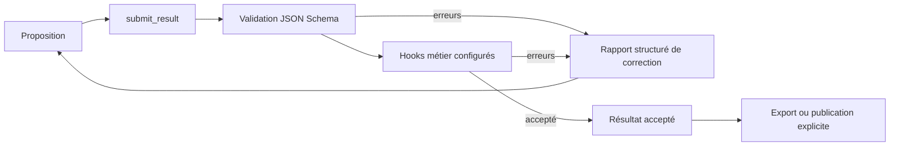

# Proposition : contrat de résultat et harness déclaratif

Date : 20-09-2026. Discussion avec Lucie pendant les essais Magic. **Design initial ; une première implémentation Rhai est maintenant décrite dans [le rapport 21](21-harness-rhai-contraintes-et-commit-experiences.md). Les formats/exporteurs envisagés ci-dessous ne sont pas tous implémentés.**

## Intention

Un template déclare le résultat attendu par JSON Schema et des validations métier. Le modèle reçoit le contrat dès le début et peut appeler `submit_result`. La réussite de la tâche exige une acceptation du harness ; un EOS du modèle ou un fichier sauvegardé n’en tient pas lieu.

## Parcours

La validation doit être réutilisable par le moteur/backend et ses clients API, MCP, TUI et web. La boucle d’agent expose l’opération, transmet ses erreurs au modèle et distingue acceptation, abandon, annulation et budget de corrections épuisé. Aucun nom de carte ni règle de deck dans le framework.

## Contrat envisagé

- Schéma de la proposition et version du contrat.
- Validateurs déclaratifs simples et références à hooks personnalisés enregistrés par l’application : fonctions, graphes ou processus selon les interfaces réellement retenues.
- Contexte de validation : source de données, version/snapshot, permissions, timeout.
- Résultat structuré : `accepted`, erreurs avec `code`, `path`, valeur constatée et contrainte attendue, avertissements, identifiant de soumission.
- Politique de fin : acceptation obligatoire pour réussite, limite de tentatives/coût, possibilité de laisser un brouillon non validé.

Exemples Magic : somme des cartes, ratio demandé pour l’exercice, possession des impressions, maximum par nom, cartes connues et cohérence de l’export. La force compétitive reste une évaluation, pas un invariant prouvable. Les valeurs 60/24 ne sont pas universelles : elles appartiennent à la configuration de cet exercice.

## Garanties à décider avant implémentation

1. `save_artifact` peut conserver un brouillon ; il ne certifie pas sa conformité.
2. Un refus structurel ne lance pas les hooks métier qui supposent une structure valide.
3. Une panne ou un timeout de validateur ne vaut jamais acceptation.
4. Les hooks sont fournis/autorisés par l’application ; le modèle ne choisit pas arbitrairement du code à exécuter comme validateur.
5. Pour des données mouvantes, l’acceptation indique le snapshot ou vérifie à nouveau les invariants lors du commit. Publication et effets externes restent des actions distinctes.
6. Les rapports de validation sont compacts, exploitables par une machine et présentables à un humain ; ils ne reposent pas uniquement sur une phrase libre.

L’expérience actuelle conserve ses défauts : on ne rajoute pas silencieusement un correcteur à un seul candidat en plein comparatif. Une série suivante pourra mesurer l’effet du harness sur les mêmes modèles.

## Formats de sortie : séparer données validées et fichiers

Jinja est un moteur de rendu textuel : Markdown, HTML, XML, texte Arena ou JSON sont possibles. Un export CSV gagne à passer par un sérialiseur qui garantit l’échappement et les séparateurs. XLSX demande un exporteur dédié au classeur et à son conteneur ; ce n’est pas un simple template texte. Le template Jinja de dialogue llama.cpp a une autre responsabilité : encoder les messages pour le modèle.

Le contrat devrait déclarer un schéma de résultat indépendant du format de livraison, puis plusieurs exporteurs. Exemple : soumettre un objet Deck une seule fois, le valider, générer son JSON, son import Arena et un XLSX multi-onglets depuis les mêmes données acceptées. Éviter de demander au modèle de recopier indépendamment chaque format.

Chaque exporteur déclare identifiant, type MIME, extension, options typées et référence au renderer/serializer. Le backend rend des descripteurs d’artefacts (nom, format, taille, empreinte, référence de téléchargement) plutôt que d’injecter un binaire ou tout le fichier dans le contexte du modèle. Prévoir l’erreur d’export distincte de l’acceptation des données et les formats exigés avant de déclarer toute la tâche terminée. Les exporteurs génériques restent hors de la logique métier Magic.

## Clarification XML et responsabilité des hooks

Lucie parlait de XML et de son projet `@luciformresearch/xmlparser`. La proposition du modèle peut être encodée en XML ou en JSON ; une étape de parsing et de conversion vers l’objet typé précède alors la validation. Le parseur ne remplace ni le schéma de résultat, ni les contrôles métier.

Les validateurs composent le harness d’acceptation. Les exporteurs (texte, XML de livraison, PDF, Word, classeur, etc.) sont des **hooks après validation**. Leur échec est un échec de livraison, distinct d’une proposition refusée. Conserver les données acceptées permet de relancer l’export sans reconstruire la proposition.

### Piste XMLParser mise de côté

À la demande de Lucie, ne pas ouvrir de chantier d’intégration maintenant. Dépôt retrouvé : [LuciformResearch/LR_XMLParser](https://github.com/LuciformResearch/LR_XMLParser), commit consulté `23f3768fc263911a4ed6d9076eb6339e91d89e93`, package déclaré 0.2.4. Lecture du code et essais directs du JavaScript compilé du dépôt, sans installation npm ni modification du projet : le parseur garde un arbre partiel et les diagnostics sur XML tronqué ; les attributs restent textuels, donc le typage métier est séparé. `<deck/><deck/>` est accepté même en mode strict dans cet état. L’API SAX prend une chaîne complète au constructeur et ne propose pas encore d’alimentation incrémentale par fragments. Ce sont des pistes de reprise ultérieure, pas des fonctionnalités ajoutées à rag3weaver. Le choix d’un parseur ne bloque pas le contrat générique de résultat.
