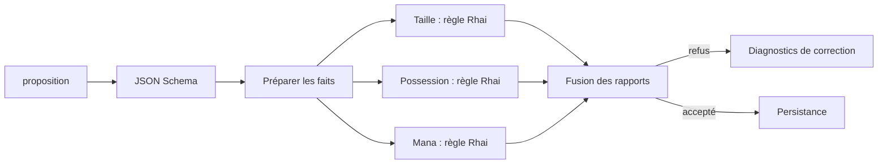

# Hooks Rhai, contraintes séparées et sauvegarde des expériences

## Décision de responsabilité

Rhai sert aux hooks écrits par l'auteur du template. L'agent Magic soumet des
données ; il n'écrit ni ne remplace ses validateurs. Aucun changement des droits
généraux d'un agent de code n'est requis. La configuration d'outils exposés reste
séparée de la définition des validations.

Une contrainte est un nœud `ValidationRuleNode`, avec script Rhai, code stable,
message paramétré, chemin et gravité. Un hook est le graphe qui les assemble.
`ValidationMergeNode` rassemble tous les diagnostics ; un refus ne masque pas
les autres règles indépendantes. Les messages gardent aussi leurs paramètres
typés et le nom du nœud, pour une interface ou un agent correcteur.

Exemple réel obtenu : `Exactly 60 cards allowed in this deck; received 57.`,
code `deck_size`, paramètres `{number:60, actual:57}`, chemin `/result/mainboard`.
Les valeurs 60 cartes et 24 terrains appartiennent à la politique de cet exercice,
et peuvent être changées sans modifier le moteur.

## Implémentation

- Moteur : `harness.rs`, `dataflow/rhai_node.rs`, `dataflow/validation_nodes.rs`.
- Backend : hooks `before`, `after`, `on_accept` sur tout outil déclaré, schéma
  d'entrée et faits chargés depuis les fichiers du template.
- Agent/chat : `completion_tool`, reçu suivi avant la troncature, `task_accepted`
  explicite dans les résultats, statut visible en web/TUI.
- [Template générique, instructions et limites](../../templates/backends/validated-result/README.md).
- [Exemple de neuf contraintes de deck](../../templates/backends/validated-result/examples/deck/validate.mmd).

Un rejet `before` interdit l'exécution du corps. `after` ne garantit pas un
rollback : son rapport indique que l'outil a déjà été exécuté. `on_accept` est
distinct de la validation et expose l'échec éventuel de livraison. Les hooks
actuels sont des calculs bornés ; les exporteurs PDF/Word ne sont pas implémentés.

Les scripts/faits sont figés au chargement. L'identité persistée est une empreinte
du contenu, pas un certificat versionné de validation. Le contrôle de mana reste
une heuristique configurable, et aucune compétitivité ou légalité complète de
format n'est promise.

## Problèmes rencontrés et résolutions

1. Un `RhaiNode` monolithique mélangeait toutes les contraintes : séparation en
   règles et fusions explicites, préparation des comptages partagée.
2. `trim` Rhai modifie sa chaîne ; l'entrée constante le refuse. Le validateur de
   nom travaille maintenant sur une copie locale.
3. Les limites de collections Rhai comptent aussi les données imbriquées. Le
   snapshot des cartes dépassait 16 384 éléments ; le budget hôte est de 131 072,
   avec plafond JSON 16 Mio, code 64 Kio, un million d'opérations et une seconde.
   Un dépassement produit un refus, jamais une acceptation.
4. Le binaire statique Rust ne réexportait pas les symboles C++ nécessaires à
   l'extension vector (`IndexAuxInfo`). `build.rs` propage `-rdynamic` aux binaires
   Linux/FreeBSD utilisant le moteur statique. Chargement et persistance vérifiés.
5. Les tests de sockets nécessitent l'accès hôte et le test d'origine suppose un
   répertoire temporaire hors Git : la suite est exécutée avec `TMPDIR=/var/tmp`.

## Vérifications

- Suite Rust `--lib --features daemon,openai-llm` : 1 107 tests réussis.
- `test_backend_harness.py` : schéma, plusieurs erreurs par soumission, hooks sur
  outil ordinaire, refus sans écriture, replay, redémarrage, échecs after/livraison.
- `test_chat_app.py` : quatre tests réussis, incluant transports web/TUI.
- Tests natifs `StringFinalizeTests` : deux tests réussis.
- Suites natives lambda/prédicats, dont `StructuredSlices` : sept tests réussis.
- Les deux anciens JSON Qwen sont refusés : 76/16 et 57/16 cartes/terrains,
  quantités non possédées pour le premier et sources de couleurs absentes.
- Une fixture corrigée de 60 cartes/24 terrains, verte/bleue, est acceptée et
  persistée. C'est une fixture de contrôle, pas une nouvelle recommandation de deck.

Les audits privés restent sous `experiments/mtga/data/model-benchmark-2026-09-20/harness`.
Ils ne sont pas ajoutés au dépôt, conformément au gitignore de l'expérience.

## Sauvegarde Git

Branche `mtg-experiments`, depuis `master`. Compte GitHub CLI vérifié :
`L-Defraiteur`. Identité Git : Lucie Defraiteur, adresse personnelle déjà configurée.
Le commit regroupe les travaux de recherche, backend, persistance, MCP, chat,
benchmarks et harness, leurs tests et les documents des 19/20 septembre.
Les bases privées, exports de collection, modèles locaux et fichiers de données
non liés à ces changements restent hors du commit. Aucun push n'est effectué.
