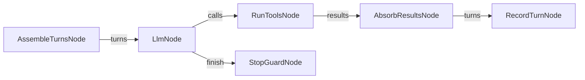

# 13 — La session comme graphe : ce qu'on garde, comment, et qui en décide

26 août 2026, 7h. Proposition de Lucie : *« la session elle-même est un DAG
personnalisable — comment on enregistre les messages, les tours, ce qu'on
garde des outils ; rien de trop* builtin*, mais des gabarits »*. Ce document
pose le dessin avant d'écrire une ligne. Il absorbe deux idées de la même
conversation — les **handles** et les options de **rendu** — parce qu'elles
sont exactement ça : des politiques de session.

## 1. Ce qui est en dur aujourd'hui

`Agent::run` (`src/agent.rs`, 1 255 lignes avec les tests) est une boucle
écrite à la main. Elle marche, elle est testée, et **elle prend seule** une
douzaine de décisions :

| Décision | Ce que la boucle fait, sans qu'on puisse le changer |
|---|---|
| Ce qu'on envoie au modèle | `turns` en entier, tel quel, à chaque itération |
| Le prompt système | ce que l'appelant a mis dans `turns[0]`, jamais construit |
| Les messages reçus | `[message de <from>] <content>`, en tours `user`, avant l'appel |
| Ce qu'on garde d'un outil | **tout** le contenu du résultat, sans borne |
| L'ordre des appels d'outils | séquentiel, dans l'ordre annoncé par le modèle |
| Quand s'arrêter | `max_iterations`, `token_budget`, `stop_on_repeated_error`, plus `final_nudge` au dernier tour |
| Ce qu'on enregistre | rien — la trace est un autre graphe, sur le bus (doc 07) |
| Ce qu'on rend au modèle après un outil | la chaîne brute, quelle que soit sa taille |

Les seuls réglages sont `AgentLimits` (quatre champs) et `GenOptions`. Tout
le reste est une opinion de la boucle. Or les mesures de cette nuit disent
que **ces opinions coûtent** : 370 000 jetons sur une question parce que
chaque résultat d'outil entier restait dans l'historique à chaque tour
([11](11-gemini-fiches-bornees-mesure.md)). On a corrigé au *rendu* ; la
politique d'historique, elle, reste en dur.

## 2. Le principe : le tour est un graphe, la boucle reste dehors

Un DAG est acyclique ; une conversation est une boucle. Donc :

> **Un tour d'agent est un graphe. La boucle qui l'exécute n'en est pas un.**

C'est le même partage que pour la trace : le graphe fait le travail, le
[réacteur](../vision_roadmap_08_2026/07-evenements-runs-et-boucles.md) tourne.
`Agent::run` devient le réacteur de la session : il boucle, il compte, il
arrête ; **ce qui se passe dans un tour** est un graphe que l'appelant
choisit.

## 3. Les six points de décision

Chacun est un nœud, avec un défaut qui reproduit exactement la boucle
d'aujourd'hui — sinon on casse ce qui marche.

| Nœud | La question qu'il tranche | Défaut |
|---|---|---|
| **assemble** | qu'envoie-t-on au modèle, ce tour-ci ? | tout l'historique, tel quel |
| **decide** | l'appel au modèle | `LlmNode`, qui existe déjà |
| **act** | quels outils, dans quel ordre, en parallèle ou non | séquentiel, tous |
| **absorb** | que garde-t-on du résultat, dans l'historique ? | le contenu entier |
| **record** | qu'écrit-on, et où | rien (la trace vit sur le bus) |
| **stop** | continue-t-on ? | `AgentLimits` d'aujourd'hui |

**`absorb` est le nœud qui compte.** C'est là que se joue le coût d'une
conversation longue : garder le markdown entier d'un `read` de 200 lignes au
tour 8 alors qu'on ne s'en sert plus, c'est le payer huit fois. Les
politiques évidentes, chacune un nœud ou un réglage :

- *entier* (aujourd'hui) ;
- *borné* : au-delà de N caractères, on garde la tête et un renvoi ;
- *périmé* : les résultats d'outils vieux de plus de K tours deviennent une
  ligne (`read port.rs:1-200 → 200 lignes, relire si besoin`) ;
- *par handle* : on garde un identifiant et un condensé, le corps est
  rappelable (§5).

## 4. Où vit l'état

Deux natures, deux places — la leçon du doc 07 (`"event_bus"` pour publier,
`"events"` pour lire : deux clés pour deux rôles).

- **L'historique du tour** circule par les **ports** : `assemble` le rend,
  `absorb` le complète. C'est une valeur, elle traverse un graphe.
- **La session** est un **service** (`"session"`), pas un port : elle est
  mutable, elle survit au tour, plusieurs nœuds y touchent. Elle porte
  l'historique complet, la table de handles, le compteur de tours, le
  budget consommé.

Et pour la **persistance**, on ne réinvente rien : la nuit a déjà produit
`Run` et `Message` liés dans le catalogue. Un tour devient une entité
`Turn` (`role`, `content`, `tool_name`, `at_ms`), liée `IN_RUN` à son `Run`.
Conséquence directe et gratuite : **les conversations deviennent
cherchables** — `search(target="Turn")`, `search_expand(target="Turn",
relation="IN_RUN")`. Un agent peut relire ce qu'il a dit hier, comme il
relit sa trace.

## 5. Les handles, à leur place

L'idée : au lieu de cacher les `uuid` (ce que fait le rendu compact) ou de
les montrer (ce qu'on payait avant), donner un **nom court, lisible et
stable dans la session** — `#execute-2` plutôt que
`8f3c1a7e-…`. Ce qui le rend utile, ce n'est pas l'étiquette, c'est qu'un
outil l'accepte :

- la table vit dans le service `"session"` : `#nom-n → (entité, uuid,
  fichier, lignes)` ;
- `RenderResultsNode(handles=true)` attribue et affiche ;
- un outil `expand(handle, relation)` — ou `read(handle)` — le résout.

Sans le dernier point, ce sont des étiquettes décoratives ; c'est pourquoi
les handles arrivent **avec** leur outil, ou pas du tout.

## 6. Le rendu est une politique, pas une question posée au modèle

**Faites le 26 au matin** (`RenderResultsNode`) — et la troisième a
révélé un défaut plus profond, voir §6 bis :

- **liens fichier** : `port.rs:101-140` au lieu de
  `file_path=port.rs · start_line=101 · end_line=140` — actionnable d'un
  coup d'œil, et c'est exactement l'argument de `read` ;
- **hiérarchie** : `PortValue::take` plutôt que `take` quand `parent_name`
  est là ;
- **regroupement** : plusieurs scopes d'une même classe sous un seul
  en-tête, au lieu de trois entrées qui répètent le contexte.

**Ce sont des réglages du nœud, pas des paramètres de la fiche.** Chaque
paramètre exposé à un modèle est une décision qu'il peut rater — mesuré
cette nuit : relations inventées, cibles fausses, `enum` nécessaires pour
l'en empêcher ([11](11-gemini-fiches-bornees-mesure.md)). Celui qui
écrit le graphe choisit le rendu ; l'agent le reçoit.

## 6 bis. Ce que le rendu a révélé

En lisant la sortie sur notre propre code, le même scope apparaissait
**deux fois**, même uuid, même lignes. Ce n'était pas le rendu :
`ResultMode::Aggregated` documente « index entry + best chunk » — une
entrée par parent — et le code émettait **une entrée par chunk attribué**.
Or la requête BM25 borne les *parents* ; les chunks sont attribués après.
Un `limit=5` rendait donc jusqu'à cinq *chunks*, parfois tous du même
scope, et l'appelant payait chacun. Corrigé : `Aggregated` tient son
contrat, `Detailed` reste le mode qui rend tous les chunks. Le rendu de
l'exemple passe de 955 à 611 caractères pour la même recherche, et une
assertion de non-régression garde la propriété.

C'est le deuxième défaut que le rendu compact met au jour après le
`list(prefix)` silencieux : **rendre lisible, c'est rendre vérifiable.**

Le « résumé des membres d'une classe », lui, demande un aller au graphe
(`PARENT_OF`) : c'est `search_expand`, donc **composable**, à ne pas câbler
dans le rendu.

## 7. Les gabarits fournis

`templates/session/` — trois, pas trente :

| Gabarit | Ce qu'il change |
|---|---|
| `plain.mmd` | la boucle d'aujourd'hui, à la lettre — le témoin |
| `compact.mmd` | `absorb` borné et périmé : les vieux résultats deviennent des renvois, avec handles |
| `grounded.mmd` | `assemble` injecte un contexte cherché avant chaque tour (RAG dans la boucle, pas seulement en outil) |

## 8. Ce qu'on ne fait pas

- **`Agent::run` ne disparaît pas.** C'est le chemin simple, testé, et le
  défaut. Le graphe de session est une option ; si le cas simple devient
  plus difficile, on s'est trompé.
- **Pas de politique implicite.** Un tour qui jette la moitié de
  l'historique doit le dire dans la trace (`TurnCompacted { dropped, kept }`
  sur le bus), sinon on débogue à l'aveugle.
- **Pas de nouveau vocabulaire.** Ports, services, nœuds, fiches, sujets,
  runs : tout existe. Une session est un graphe comme les autres, sinon la
  proposition ne vaut rien.

## 8 bis. Ce à quoi la session s'abonne

Un graphe de session doit pouvoir dire « je veux savoir quand un outil du
run que j'ai lancé échoue » sans écouter la terre entière. C'est le sujet
du [14](14-tout-est-ecoutable.md) : sélecteurs (`run`, `tag`, `kind`,
`node`, `port`, `dir`), prédicats sur les champs, un registre d'intérêt
pour ne pas fabriquer ce que personne n'écoute — et la cellule comme
espace de noms, pour qu'un joker ne traverse jamais une organisation. Les étapes 1 et 2 de ce
document-là suffisent à rendre la session écrivable.

## 9. L'ordre, et comment on saura

1. **Rendu** (liens, hiérarchie, regroupement) — une heure, mesurable au
   caractère près comme le rendu compact l'a été.
2. **Handles + `expand(handle, …)`** — le service `"session"` naît ici.
3. **Entité `Turn` + `IN_RUN`** — les conversations cherchables ; le test
   est « l'agent retrouve ce qu'il a dit au tour 2 ».
4. **`absorb` en nœud, `compact.mmd`** — le test est une conversation de
   dix tours dont on mesure les jetons, avec et sans : c'est le chiffre qui
   dira si tout ça valait la peine.
5. **`assemble`, `stop`, `grounded.mmd`** — seulement si 4 a payé.

Les étapes 1 à 3 valent d'elles-mêmes, même si on n'allait pas jusqu'à 5.
